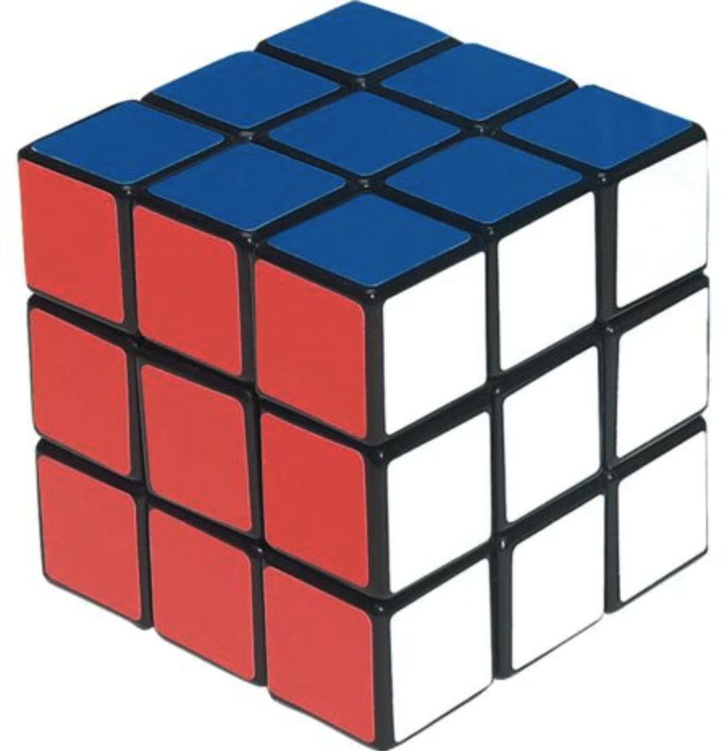
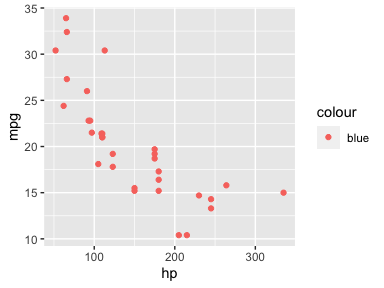

Homework 5
================



**Slicing, Viewing, and Copying Arrays**

1.  Create two numpy arrays that are 3 x 3 identity matrices:
    
      - `I_3A`: a coerced list of lists
      - `I_3B`: built using the constructor method `eye()`.
    
    Be sure that both arrays are of type integer
    ([Section 2.1](https://jakevdp.github.io/PythonDataScienceHandbook/02.01-understanding-data-types.html)
    in Python Data Science Handbook may be helpful here. You can query
    the data type attribute of an array by calling the relevant
    attribute). Check your work by testing the equality of the two
    arrays.

2.  Use slice indexing on `I_3A` to create a new matrix `I_2_UL`, a 2 x
    2 identity matrix, from the upper-left corner of `I_3A`. Does
    creating this object change the nature of `I_3A`?

3.  Use slice indexing to change in place the values of `I_2_UL` so that
    it is a matrix of all `1`s. Does this change the nature of `I_3A`?

4.  Similar to exercises 2 and 3, use slice indexing on `I_3A` to create
    a new matrix `I_2_LR` from the lower right corner of `I_3A`. This,
    time, however, append the `.copy()` method to your slice indexing
    when you’re creating the new array. Use indexing to change in place
    the values of `I_2_LR` so that it is a matrix of all 1s. Does this
    change the nature of `I_3A`?
    
    **Broadcasting and vector recycling**

5.  Consider the following arrays:
    
    ``` python
    A = np.array([1])
    B = np.array([1, 2, 3])
    C = np.array([[4],
                  [5],
                  [6]])
    ```
    
    1.  What is the *shape* of each array?
    2.  Try adding each pair of arrays togethers and observe the result.
        In a few sentences, describe precisely how Python carries out
        operations on arrays that differ in their shape.
    3.  Demonstrate what happens when you add an array of shape `(2, 3)`
        to it’s transpose.

6.  While that behavior in Python is called *broadcasting*, the nearest
    analog in R is called *vector recycling*. Try adding each pair of
    the following objects together; some of them vectors, some of
    matrices (special cases of arrays). Based upon the results, precise
    describe how/if R carries out operations on vectors and matrices of
    different shape.
    
    ``` r
    A_vec <- 1
    A2_vec <- c(1, 2)
    B_vec <- c(1, 2, 3)
    B_mat <- matrix(c(1, 2, 3), nrow = 1)
    C_vec <- c(4, 5, 6)
    C_mat <- matrix(c(4, 5, 6), ncol = 1)
    ```

7.  What follows is a simple scatterplot that features one of the most
    common errors to new users to `{ggplot2}`. Note, though, that it
    doesn’t throw an error\! How can this behavior be explained by
    vector recycling?
    
    ``` r
    library(ggplot2)
    ggplot(mtcars, aes(x = hp, y = mpg, color = "blue")) +
        geom_point()
    ```
    
    
    
    **Aggregated Operations**

8.  Use `x = np.random.normal(loc = 7, scale = 2, size = (12, 4))` to
    generate a 12 x 4 array of random variables, each drawn from
    \(N(\mu = 7, \sigma = 2)\). Treat this as 12 observations on 4
    varibles.
    
    1.  Use `dir()` to remind yourself of the methods available to a
        numpy array. Using the appropriate method, find the mean,
        standard deviation, and maximum values within each column.
    2.  Using the results of these computations, create a new 12 x 4
        array called `Z` that is the z-scores corresponding to each of
        the observations. Check that it is correct by computing it’s
        columnwise mean and standard deviation.
    3.  Explain how broadcasting was involved in the computations from
        the previous exercise.
