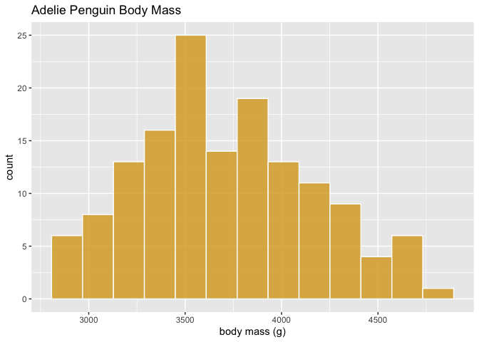
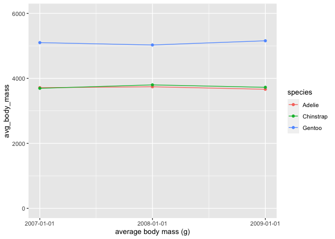

Homework 10
================


This lab features a gallery of several canonical plot types made in
`ggplot2`. Your task is to recreate them using `seaborn` and
`matplotlib`. As you work, I recommend using as a reference seaborns
[excellent web documentation](https://seaborn.pydata.org/).

  - You’re welcome to use the atomic `seaborn` plot functions
    (`scatterplot()`, `boxplot()`, etc.) or their wrapper equivalents
    (`relplot()`, `displot()`, and `catplot()`).

  - In terms of aesthetics, do try to match the main elements of the
    ggplot: the plot type, line types, the colors, the labels, and the
    title. Don’t worry about getting the sizes identical or all of the
    axis tick marks to match up.

  - Your code for these plots might involve bits of `pandas`, `seaborn`,
    and `matplotlib`. You’re at a good point now where you should be
    able to get your code *working* fairly easily, so pay some attention
    to getting your code simple, readable, and well-formatted.

  - While reproducing all five of these plots in `seaborn` will give you
    the most practice with its functionality, if you are short on time,
    it is fine to select three of them to do.

As you begin this journey from `ggplot2` users to `seaborn` users, I
encourage you to read a [blog
post](https://robinsones.github.io/Better-Plotting-in-Python-with-Seaborn/)
of data scientist Emily Robinson, as she went on a similar journey.

You’ll want to start by prepping your R session,

``` r
library(tidyverse)
library(palmerpenguins)
data(penguins)
penguins <- drop_na(penguins)
```

as well as your Python session.

``` python
import pandas as pd
import seaborn as sns
import matplotlib.pyplot as plt
# penguins = pd.read_csv("https://raw.githubusercontent.com/andrewpbray/python-for-r-users/master/data/penguins.csv")
# plt.style.available
plt.style.use('ggplot')
```

You may want to set up a parallel notebook to allow you to iterate on
your seaborn plots a little more easily. If you do that, it will be
easiest to read in the penguinds data from the csv file. Importantly:
currently [Berkeley’s
DataHub](https://datahub.berkeley.edu/user/andrewbray/tree) is using an
older version of `seaborn` and there have been several important updates
for current version `0.11.0`. To use the current version in your
notebook, add a cell at the top with `!pip install seaborn==0.11.*`.

#### Example: Single histogram

Below is the `ggplot2` code to generate a histogram and an analog using
`seaborn`. You’ll note that even though they both have 13 bins, the
plots end up slightly different from one another, despite the fact that
they’re using the same data. The difference is that they use two
different rules for determining when to start the first and last bins
after the first and last observations, respectively. You may come across
similar slight differences in the course of this homework; don’t worry
about ironing them out perfectly.

``` r
penguins %>%
  slice(-1) %>%
  filter(species == "Adelie") %>%
  ggplot(aes(x = body_mass_g)) +
  geom_histogram(bins = 13,
                 color = "white",
                 fill = "goldenrod",
                 alpha = .8) +
  xlab("body mass (g)") +
  ggtitle("Adelie Penguin Body Mass")
```

<!-- -->

``` python
p = sns.histplot(x = "body_mass_g", 
                 data = r.penguins[r.penguins["species"] == "Adelie"].iloc[1:, :],
                 bins = 13,
                 color = "goldenrod")
p.set_xlabel("body mass (g)")
p.set_title("Adelie Penguin Body Mass", loc = "left")
```


1.  
<!-- end list -->

``` r
penguins %>%
  ggplot(aes(x = bill_length_mm,
             y = flipper_length_mm,
             color = species)) +
  geom_point(size = 1.5, alpha = .5) +
  labs(x = "bill length (mm)",
       y = "flipper length (mm)",
       title = "Penguin physiology by species")
```

<!-- -->

2.  
<!-- end list -->

``` r
penguins %>%
  ggplot(aes(x = island,
             y = bill_length_mm)) +
  geom_boxplot() +
  coord_flip() +
  labs(y = "bill length (mm)",
       x = "island",
       title = "Penguin bill length by island") 
```

<!-- -->

3.  
<!-- end list -->

``` r
penguins %>%
  ggplot(aes(x = body_mass_g,
             fill = species)) +
  geom_density(alpha = .5) +
  facet_grid(rows = vars(island))
```

<!-- -->

4.  
<!-- end list -->

``` r
penguins %>%
  ggplot(aes(x = species,
             fill = sex)) +
  geom_bar(position = "fill")
```

<!-- -->

5.  
<!-- end list -->

``` r
library(lubridate)
penguins %>%
  mutate(year = ymd(year, truncated = 2L)) %>%
  group_by(species, year) %>%
  summarize(avg_body_mass = mean(body_mass_g)) %>%
  ggplot(aes(x = year,
             y = avg_body_mass,
             color = species)) +
  geom_line() +
  geom_point() +
  lims(y = c(0, 6000)) +
  labs(x = "average body mass (g)") +
  scale_x_date(date_breaks = "1 year")
```

<!-- -->
