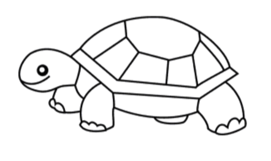

Lab 3: Practice with Turtles
================



To get more practice with functions and methods, you’ll be making some
very rudimentary drawings using a package called `turtle`. A note about
this lab: it uses an external graphics window and may be a bit fussy to
run through RStudio and `reticulate`. I recommend that you also open a
terminal window to run the code at the command line in python directly.
This will have smoother performance while you’re tinkering around, then
copy your final work into your Rmd. Be sure to review your pdf to be
sure it looks clean before submitting it.

If you run into questions or problems, please post to Piazza.

-----

Start by importing the `turtle` package with the `import` keyword.

``` python
import turtle
t = turtle.Turtle()
```

This should open a graphics window for you with a small black arrow in
the center. That is your turtle, and you’re able to move it around the
canvas to draw pictures using its methods.

Before you start drawing with your turtle, consider that last command
that you ran; the dot syntax here is illuminating. It suggests that
`turtle` is an object of a particular class and that `Turtle` is one of
it’s methods.

1.  What class is the object `turtle`? You can find out either with the
    `type()` function or the `__class__` attribute of that object.

2.  Name three more methods available to objects of class `turtle`.

This returns us to the notion that “Everything is an object”, including
the package / module `turtle` that we just imported, and to the practice
to associate objects with specific methods.

You can think of `turtle.Turtle()` acting like `turtle::Turtle()` in R -
it’s calling the `Turtle()` function in the `turtle` package - but the
Python does have an extra layer of coherence because it’s within the
same object-oriented programming framework. And although the help file
for the `.Turtle()` method doesn’t say it very clearly, the method
serves to create a new blank object of class `turtle.Turtle`, your
drawing turtle.

Let’s take the turtle for a test drive. Run the following code.

``` python
t.right(90)
t.forward(100)
t.goto(100, 100)
t.goto(0, 0)
```

3.  Based on the performance of the turtle after running each of these
    commands and after looking at their help files, describe what each
    of the three different methods do.

You’ll notice that you can either move the turtle relatively (e.g. turn
left, walk forward) or in terms of the absolute cartesian coordinates.

4.  Write the commands that will make the turtle draw a second triangle
    that’s a reflection of the first about the line x = 0. This should
    create a large arrow of a similar shape to the turtle, facing down.

5.  This would make a much more convincing large turtle shape if it were
    filled in with the color green. Look through the available turtle
    methods for ones with helpful looking names and bring up their help
    files, then compose several of them together to fill in the empty
    arrow with the color green.

For your final pdf that you submit, you’ll want to be sure to take a
screenshot of your graphics window and include it. Run the following
chunk once to take the screenshot and convert it to a png. After that,
you can set `echo` and `eval` to `FALSE` in your chunk options.

``` python
# Set this chunk to eval = FALSE after having run it once.
ts = turtle.getscreen()
ts.getcanvas().postscript(file = "green-turtle.eps")

from PIL import Image
img = Image.open("green-turtle.eps")
img.save("green-turtle.png", "png")
```

Then, to include that png in your Rmd, you can include:

``` r
knitr::include_graphics("green-turtle.png")
```

We’ll be moving one to a new shape, so go ahead and clear your canvas
using `t.clear()`.

6.  Write a function that draws a golden equilateral triangle, taking as
    input the length of a side.

7.  Use that function to draw the
    [Triforce](https://en.wikipedia.org/wiki/Triforce). Go through the
    same process as above to take a screenshot, save it as a png, and
    include it in your final pdf.
