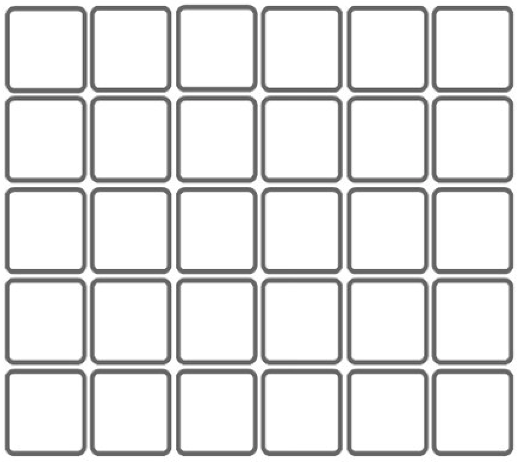

Lab 4: More practice with Turtles
================

Now that we have most of the fundamentals of the Python language in our
toolbox, we’re able to stitch together a more complex program. There are
only two questions for this lab, but each requires more careful coding
than previous labs. I recommend starting on paper to sketch out in
pseudo-code how you’ll solve the problem, then turn to thinking how
you’ll implement it in Python.

As always, if you have questions, please ask over Piazza.

1.  Each morning after her cup of coffee, the turtle goes for a walk
    through her neighborhood, which is defined by a regular square
    street grid where each block is of length `s`. Write a program using
    `turtle` to draw one of her walks according to the following
    guidelines
    
      - She lives right on the corner (at the vertex in our regular
        street grid), and selects which direction she will head
        uniformly at random.
      - Every time she approaches an intersection, she chooses randomly
        between turning left, turning right, and proceeding straight
        ahead, each with probability 1/3.
      - Two useful tools for simulating the random process are the
        `random()` function imported using `from random import random`
        and the `randint()` function imported using `from random import
        randint`.
      - She always walks 25 block faces, each of length `s`.
    
    Provide in your lab report the code necessary to draw a walk and
    include the images of two random walks.

2.  Write a function to draw a generalized *Poly*force that takes as an
    argument `n`, the number of golden triangles to include (note that
    the [Triforce](https://en.wikipedia.org/wiki/Triforce) sets this
    argument to 3). Some guidelines:
    
      - Reuse the function that you wrote last lab to draw a single
        triangle.
      - Construct the Polyforce either using `for` or `while` loops.
      - Your function should return only complete Polyforces; i.e. the
        final shape should be a full equilateral triangle. Do this by
        raising an exception depending on the value `n` that user
        provides (see p. 49 in *Whirlwind*).
      - Use a similar approach to preventing your user from supplying an
        `n` so large that it would crash the program.
      - Your Polyforce should be oriented upright, with the peak of the
        triangle facing straight up.
    
    Please include in your lab report your code as well as an image of a
    Polyforce with `n = 10`.
