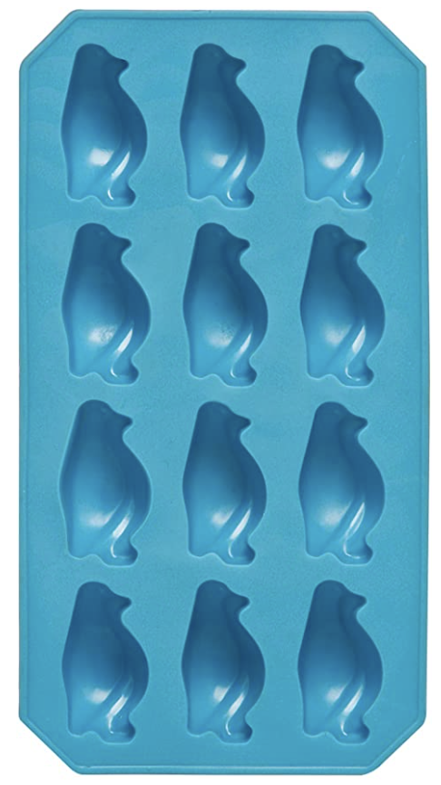
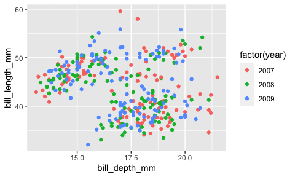

Lab 5: More practice with Penguins
================



Consider a plot that’s a riff on the one you made in Lab 2. Here we plot
penguin bill length vs bill depth, separated out by year.

``` r
library(palmerpenguins)
library(ggplot2)
ggplot(penguins, aes(x = bill_depth_mm,
                     y = bill_length_mm,
                     color = factor(year))) +
  geom_point()
```



Previously, we used the strained functionality of a dictionary of lists
to subset this data and replot it. In this lab, we’ll be working with
the data as a numpy array, which will give us a bit more power.

1.  Load the `penguins` data from `{palmerpenguins}` in R and run it
    through `tidyr::drop_na()` to remove rows with missing values. Next,
    bring it into Python as `pypenguins`. Just to remind ourselves: what
    is the type of `pypenguins`? What is the type of the values of each
    of its elements (this you can just assess visually)?

2.  Our goal is to change the type of `pypenguins` to be a numpy array,
    but we have a problem: currently it is type *heterogeneous*. Let’s
    solve that by working only with the numerical data that it contains
    and drop the strings. Our tool for this will be a dictionary
    comprehension.
    
    A dictionary comprehension is very similar to a list comprehension -
    it’s essentially short-hand for a for loop - but it returns a
    dictionary instead. Here is an example of such a construction:
    
    ``` python
    d = {'a': 1, 'b': 2, 'c': 3, 'd': 4}
    {k:v*2 for (k,v) in d.items() if k == 'd'}
    ```
    
        ## {'d': 8}
    
    Recall that you can access three forms of iterable elements in a
    dictionary `d` using `d.keys()`, `d.values()`, `d.items()`. 1. Using
    a dictionary comprehension, create a new dictionary from
    `pypenguins` that contains only numerical data. 1. Extract the
    values from this dictionary and put them into a numpy array called
    `pg_array`. You may need to fiddle with it to get it just right, but
    aim for a 344 x 5 array of floats.

3.  Split the array into three separate arrays, each one containing data
    from a different year. This combines two steps: making a *boolean
    mask* (the familiar structure of, say, `x[x<7]`) and then slice
    indexing.

4.  Compute the mean beak and bill length for each of the three years of
    data. Has there been any change over time?

5.  In which year was the maximum bill length observed? What about the
    minimum bill length length? Check your answer by looking at the plot
    above.

6.  Bring the 2007 data back into R and make a scatterplot of bill
    length vs bill depth. Though this procedure we through seems
    trivial, note that it actually wasn’t possible with the dictionary
    techniques we used in Lab 2. To subset the rows of `bill_length` and
    `bill_depth` based on values of `year` requires a link between the
    `i` and `j` indices of a matrix, which is something made possible by
    the numpy array.
