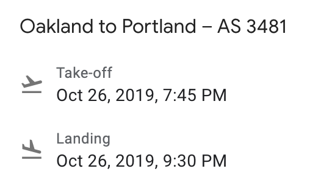

Lab 6: Wrangling Takeoff
================


The `calflights` package contains a data set called `flights` that
contains *all* of the flights that left from San Francisco International
Airport and Oakland International Airports between July 1st and December
31st 2019. This will serve a rich data set to practice your data
wrangling skills with `pandas`. This lab focuses on four fundamental
tasks in wrangling:

  - Getting the lay of the land
  - Accessing rows and columns
  - Boolean masks (logicial subsetting)
  - Calculating aggregate statistics

Start this lab in R, where you will load the `flights` data frame from
the package. Note that this is a *large* data set, so if you’re working
on a machine with limited memory, you may want to opt for working
through this lab with `small_flights` instead of `flights`.

``` r
# install.packages("remotes")
remotes::install_github("andrewpbray/calflights")
library(calflights)
library(reticulate)
library(dplyr)
data(flights)
small_flights <- flights %>%
  sample_frac(.10)
```

## Getting the lay of the land

A convenient part of working with data set stored in an R package is
that it will often have an associated help file. Read through the help
file for `flights` to acquaint yourself with the variables it contains.
You may want to consult with this throughout the lab.

1.  Bring `flights` into python, coerce it to a pandas dataframe, and
    call `dir()` on it to print out a lengthy list of methods. Select
    two methods whose behavior you can guess based on their name, and
    describe that guess. Check their help file to see if your guesses
    are correct. Repeat this with two other methods that have, by
    contrast, very puzzling names.

2.  Often the first stop when looking at a new data set is getting a
    birds eye view of the structure. Test out `.head()`, `.tail()`,
    `.describe()`, `.columns`, and `.dtypes`. Which R functions most
    closely mirror this functionality?

3.  While this behavior is quite similar between the two languages, the
    dot syntax has some behaviors that will be unexpected to an R user.
    Try `.year` or `.dest`. What would you use to get similar behavior
    in R?

## Accessing rows and columns

4.  Pandas has many different methods by which you can access rows and
    columns, but probably the most commons is to use the `[]` operator.
    Print out the values of the `dest` variable by passing it as a
    string inside square brackets. To keep things clean, only actually
    print out the first 4 rows by appending your commands with
    `.head(4)`.

5.  Repeat the exercise but print out the first four values of both
    `dest` and `origin` by them as a list into the square brackets. Try
    also passing only `dest` as a list. In general, what happens when
    you subset the columns with a string versus with a list?

6.  The `[]` operator can also be used to access rows of the data frame
    if you pass it a slice instead of a string or list of strings. This
    accesses the implicit indices (the integer order) of the rows of the
    dataframe. Use this approach to print out the second and third rows
    of the data.

7.  In addition to applying `[]` directly to a dataframe, you can also
    apply it to the explicit (named) or implicit (integer ordered)
    indices of the dataframe. Print out the `dest` and `origin` of the
    second and third rows using two methods: a) first subset the columns
    using `[]`, then subset that object using `[]` b) subset both
    simulatenous by apply a single `[]` to the explicit indices in
    `flights.loc()`.

## Boolean masks

8.  Create a boolean mask object called `is_oak` that is `True` when the
    flight came from Oakland International Airport and `False` when the
    flight came from San Francisco International Airport. What is the
    type of that object?

9.  Boolean masks can be strung together if you wrap them in `()` and
    combine them using `&` and `|`. If you flew on a flight that
    departed from either SFO or OAK in the time window covered this
    data, find that flight’s record. Did you land at your destination on
    time? Bonus points (not really) for including a photograph of the
    actual airplane that made this flight. Bonus bonus points (still not
    really) for including first-hand documentation that you were indeed
    early, on time, or late.
    
    Some advice: if you can’t find your flight on first pass, try
    searching using different criteria. I have yet to have taken a
    flight that doesn’t show up in the database that this data set pulls
    from. Often data sets have a bit of messiness in them\!
    
    If you didn’t fly within this window, find the record corresponding
    to a flight that I was on.



10. Create a new data frame that includes flights headed from the Bay
    Area to New York in November and save this data frame as
    `nyc_nov_flights` (note that the city has two major airports: JKF
    and LaGuardia). Peek at the resulting columns to check if your
    subsetting operation worked correctly. How many flights meet these
    criteria?

## Calculating aggregate statistics

11. Calculate the mean and median departure delay for flights heading to
    NYC in November. Does a positive number imply that the flight left
    early or late? What can you infer by the relative magnitude of the
    mean and median?

12. Create a second data set called `nyc_jul_flights` that is similar,
    but contains data from July. Calculate the mean and median departure
    delay. Use any knowledge you have about air travel and weather to
    speculate why you see this difference between July and November.

13. Bring these two small dataframes back into R and use them to
    visualize the difference in the distribution of departure delays to
    NYC in July and November (`dplyr::bind_rows` is an efficient way to
    combine two dataframes into one).
