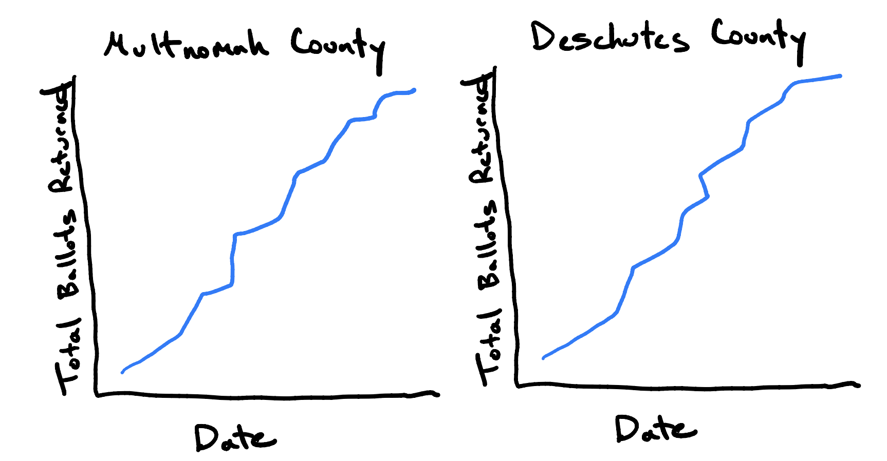
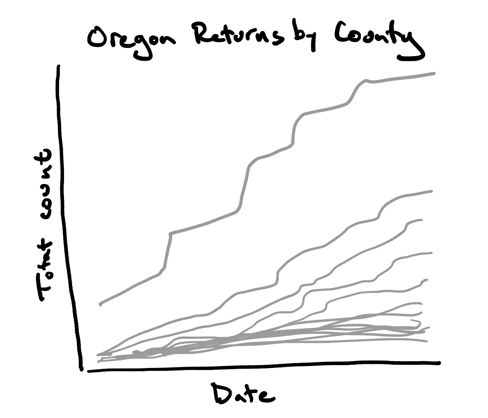
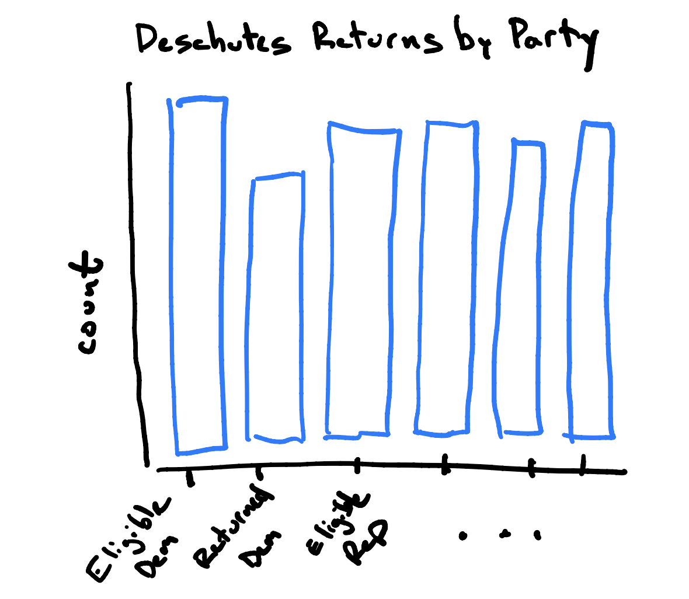

Lab 9: Reshaping Votes
================


In 1998, Oregon became the first state to conduct its elections
exclusively by mail. Every election, all registered voters are
automatically mailed ballots to their home address roughly a month
before the election. Voters then vote at their leisure and mail back or
drop off their ballot sometime before the election closes. Due to
concerns about the Covid-19 pandemic, many other states have implemented
some version of Oregon’s voting system in preparation for the November
3rd, 2020 election next Tuesday.

Since mid-October, when the first completed ballots started returning to
Oregon election offices, the Secretary of State’s office has been
posting the ballot return data on [their
website](https://sos.oregon.gov/voting/Pages/current-election.aspx). In
this lab you’ll be using this data to construct three visualizations
that will help understand some of the dynamics of the 2020 election in
Oregon.

### Set-up

The election returns data is stored in a pdf on the website linked above
and titled, “Unofficial Daily Ballot Returns”. This is a common way that
public data is distributed and it is . . . unfortunate. As a file
format, a pdf is only meaningful to a program that is designed to
display that format. You can’t, for example, open it up in a text editor
and pull out anything intelligible. It is meant as a *display* format,
not a format to encourage further engagement and analysis.

Some years ago, this would be a dead end for data analysis unless you
wanted to transcribe those data tables manually. Now, however, there is
software that reads the pdfs and does its best to extract the tabular
data. The `tabula` package is an example of such software and works
quite well. It can be installed within an R chunk using
`reticulate::py_install("tabula-py", pip = TRUE)` (although you install
the package called `tabula-py`, you’ll be importing a package called
`tabula`).

1.  Download the pdf from the Secretary of State’s website to your
    machine and put it in the same directory as your lab .Rmd file. Use
    the function `tabula.read_pdf()` to read in the pdf file and tinker
    with its arguments to figure out how it works. What data structure
    does the function return? How many tables total does the function
    identify in the pdf?

#### Plot 1: Cumulative ballot returns for Multnomah and Deschutes counties



There are several steps needed to clean up and process the data before
you can plot it.

2.  You’ll notice that there are several rows at the bottom of the table
    that contain aggregate information. Since you won’t need them for
    your plot, strip out these rows.

3.  The first column has a lengthy name, so `.rename()` it to
    `"County"`.

4.  The unit of observation in your data set at this point is a single
    county and on that county you observe a count at each of several
    dates. Reshape this data frame so that the unit of observation is a
    county on a particular date and the variable recorded is the
    returned ballot count. Your resulting data frame should have three
    columns: `"County", "Date", and "Count"`.

5.  When the data frame was read in, the `Count` column read in as a
    string Series with commas. Strip out those commas. There are
    multiple ways this can be done, but a good starting place is a data
    frame method called `.replace()` or string methods.

6.  Now that the counts are in good shape, you need to be sure the data
    types of all of the columns are as you want them. `"County"` should
    be strings, so that one’s all set. `"Count"`, however, should be
    either integer or numeric and `"Date"` should be a datetime. There
    are, as always, multiple ways to skin this cat. I recommend looking
    into a handful of Pandas functions named `to_XXX` where `XXX` is the
    type that you want to convert to. There is also a `.astype()` data
    frame method that works.
    
    The conversion of `"Date"` to a datetime can be tricky, so approach
    that one carefully. You’ll need to specify the `format`, which you
    do as a string using a particular [format
    code](https://docs.python.org/3/library/datetime.html#strftime-and-strptime-behavior)
    that indicates what you’re giving it (in this case, the abbreviation
    of the month name and the day of the month). Post on Piazza if you
    run into problems.

7.  Instead of plotting the raw county, the plot that you’re aiming for
    has on the y-axis the *cumulative* count. Create that new column -
    the cumulative count within each county.

8.  From this parent data frame, create two child data frames: one with
    the data from Multnomah County (Portland metro area) and the other
    containing the data from Deschutes County (Bend metro area).

9.  Use `matplotlib` to construct the final plot shown above. Your main
    guide through this will be the [first few pages in Python Data
    Science
    Handbook](https://jakevdp.github.io/PythonDataScienceHandbook/04.00-introduction-to-matplotlib.html).
    A few notes:
    
      - You’ll want to make a single figure with two subplots.
      - Rotate the labels on the x-axis so that they’re legible.
      - Label the axes and add a title to each subplot.
      - Save the figure using `plt.savefig()` and include it in your Rmd
        by adding an R chunk containing
        `knitr::includegraphics("myfig.png")`.

#### Plot 2: Cumulative ballot returns for all Oregon counties



10. Plot the cumulative ballot count curves for *all* Oregon counties on
    a single plot. This requires two steps: a) reshaping your data so
    that each row corresponds to a date time and there is a column for
    each county containing its cumulative counts and b) iterating over
    `plot()` to draw a line for each county onto the same plot. For step
    b), mimic the for-loop structure found in the example
    [here](https://python-graph-gallery.com/124-spaghetti-plot/). A few
    notes:
    
      - Make all lines the same color (there are too many to discern
        anyway).
      - Shine up the labels and add a title as before.
      - Save the file as before an include it in your Rmd.
    
    Yes, this is an ineffective plot for displaying this structure.
    We’ll fix it at a later date.

<!-- ## Plot 2b -->

<!-- ```{python} -->

<!-- df3 = df2.pivot(index = "date", -->

<!--                 columns = "County",  -->

<!--                 values = "cumulative count") -->

<!-- column_maxes = df3.max() -->

<!-- df4 = df3 / column_maxes -->

<!-- ``` -->

#### Plot 3: Comparing ballot returns by party



The final page of the pdf adds in another piece of important
information: it breaks out the ballot return numbers by party. Use it to
create the plot above, which shows, as of October 29th, the voter
turnout by among Democrat, Republican, and Unaffiliated voters in
Deschutes County. Deschutes County is particularly interesting because
it is fairly evenly split between voters of all three affiliations. As
in plot 2, the form of this plot has some deficiencies that we’ll
discuss, but it’s a place to start for now.

Some notes:

  - You can recycle much of your code from plot 1.
  - Pdf reading is not an exact science. Be sure to spot check the
    resulting data frame and make any necessary corrections.
  - Focus only on Republican, Democrat, and Unaffiliated voters and only
    on Deschutes County.
  - Instead of using `.plot()`, you’ll be using `.bar()`. Read its
    documentation to understand the structure of the data the it
    expects.
