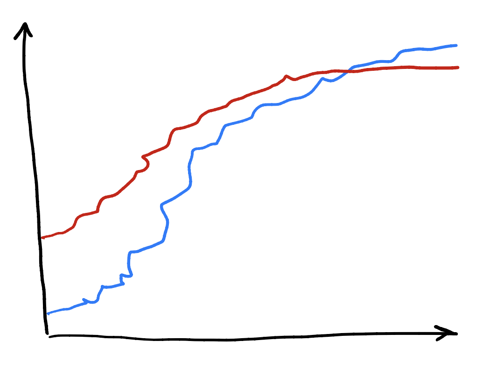

Lab 10: Scraping By
================

Your objective for this lab is to use `seaborn` to visualize the
cumulative vote totals for Donald Trump and Joe Biden in the days
following the elections. The data you’ll be using are displayed here:

<https://alex.github.io/nyt-2020-election-scraper/battleground-state-changes.html>

and can be downloaded here:

<https://alex.github.io/nyt-2020-election-scraper/battleground-state-changes.csv>

This data set has been scraped from the New York Times website as a JSON
file and saved as a .csv, as described
[here](https://alex.github.io/nyt-2020-election-scraper/).

Produce two plots, one for Pennsylvania and one for Georgia. For each
plot,

  - Be sure the dates on the x-axis are easily legible.
  - Color line for Donald Trump red and the line for Joe Biden blue.
  - Add titles
  - [Annotate the
    point](https://jakevdp.github.io/PythonDataScienceHandbook/04.09-text-and-annotation.html)
    in time when the AP declared Biden the winner (`plt.axvline` may
    also be useful).
