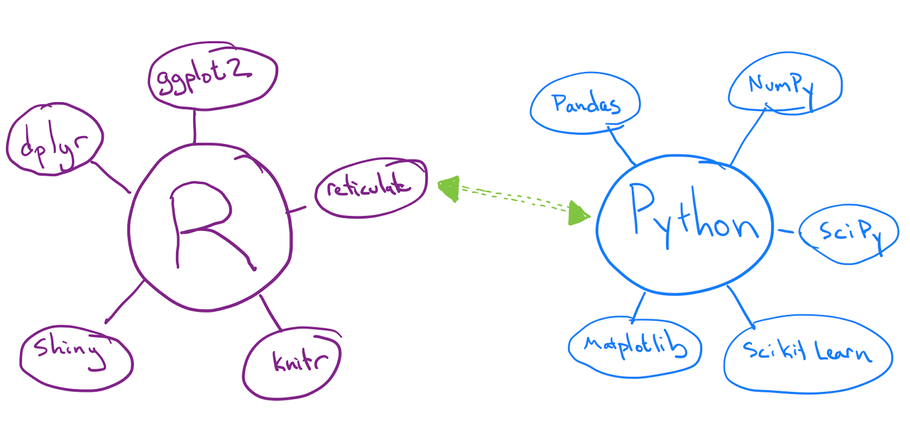
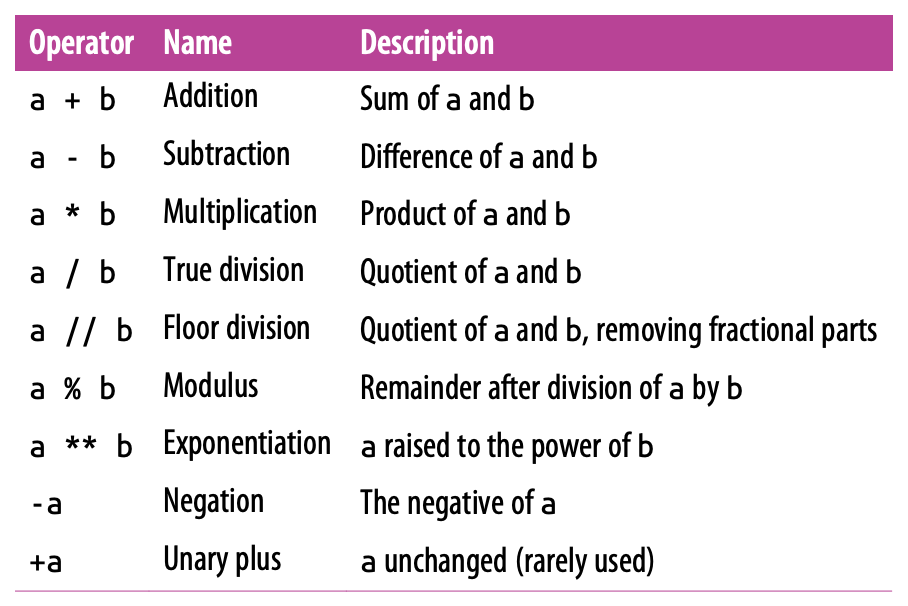

```{r include = FALSE}
knitr::opts_chunk$set(message = FALSE, fig.align = "center")
library(tidyverse)
```

# Something to start things off

In a brower on your laptop or phone, go to slido.com and enter event code #Z837.

> **Poll**: Describe your first week of classes in one word.

--
* * *

## Slido

- Polls
- Q & A (with upvotes)


---
# By the end of this course you will...

--

- Use Python to conduct the full data science life cycle on a simple project, including data import, wrangling, visualization, and modeling.

--

- Have a sense of the software ecosystem involving R and Python.

--

- Be able to describe the relative strengths of Python and R.

--

- Understand more about the structure of R.


---
# Disclaimer

--

I am not a Python expert. I'm an R User that's (re-)learning Python.


---
# Course Structure

## Course website

- `www.github.com/andrewpbray/python-for-r-users`

## Course communication

- `www.piazza.com/`

## Assignments

- Submitted and graded on `www.gradescope.com`

---
# Lecture Style

- Slides + live coding

--

- Feel free to play along, but don't get tunnel vision

--

- If you encounter an issue / error, please ask over Slido.


---
# Accessing and installing Python

## How will we access Python?

--

We'll start off using `{reticulate}`, an R package.

--

## Which installation will we use?

--

`miniconda`, a lightweight installation that includes Python and conda, a package management system.

--

> **Poll**: Were you able to install `reticulate` and `miniconda`?

---
# An expanded ecosystem

## Where does `{reticulate}` fit in?

--

```{r echo = FALSE, out.width="100%"}

```

--

`{reticulate}` is an R package that starts a Python session within your R session.

---
# Alternatives to {reticulate}

1. Running `python` at the terminal

--

2. Running `ipython` at the terminal

--

3. Running `python` within a Jupyter notebook


---
# Python as a calculator

--

```{r echo = FALSE, out.width="100%"}

```

---
# Python basics: syntax

## How do you assign objects?
- 


## How do you print?
- 


## How do you comment?
- 


## How does whitespace work?
- 


---
# Whitespace

> **Poll:** Which of the following will throw an error?

```{r whitespace-poll, eval = FALSE, echo = TRUE}
# A
a = 1 + 3

# B
a         = 1 +       3

# C
if(a > 2)             {
         
      "so big!"
}

# D
if(a > 2) {
  "so big!"
}
```

---
# Python basics: syntax

## How do you assign objects?
- Assign with `=`

## How do you print?
- `print()` or type name of object

## How do you comment?
- Comments marked by `#`

## How does whitespace matter?
- Yes (indentation) and no (midline)


---
# Python basics: semantics

--

## What are variables?

- 
- 

## What are objects?

- 

---
# Python basics: semantics

## What are variables?

- Variables do not need to be declared
- Variables are *pointers* -> functions can change their arguments.

## What are objects?

- 


---
# John Chambers on S (2008)

> The central computation in R is a function call, defined by the function object itself and the objects that are supplied as the arguments. In the functional programming model, the result is defined by another object, the value of the call. Hence the traditional motto of the S language: **everything is an object**—the arguments, the value, and in fact the function and the call itself: All of these are defined as objects. Think of objects as collections of data of all kinds. The data contained and the way the data is organized depend on the class from which the object was generated.

---
# Python basics: semantics

## What are variables?

- Variables do not need to be declared
- Variables are *pointers* -> functions can change their arguments.

## What are objects?

- Everything is an object: data with *attributes* and *methods*


---
# A note about {reticulate}


---

```{r echo = FALSE}

```


---
# A note about {reticulate}

`{reticulate}` can pass objects between your Python and R session.

- Python object `b` can be accessed in R using py$b
- R object `a` can be accessed in Python using r.a

---
# Until next time

--

- Schedule a meeting if you need help configuring your system (link in chat)

--

- Homework 01 / Lab 01 will be posted by midnight tonight and due Sunday at 8 pm
- Submit work as pdfs to gradescope
