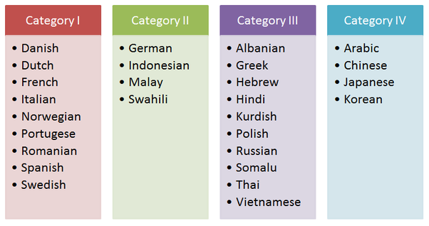
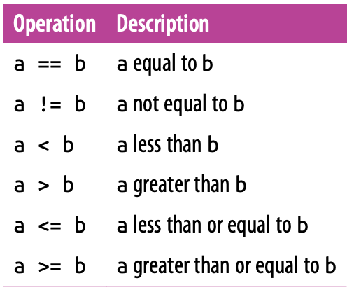
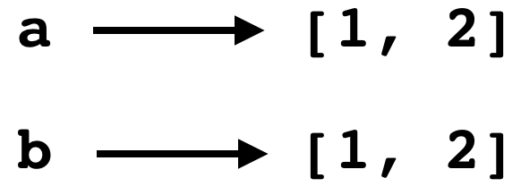
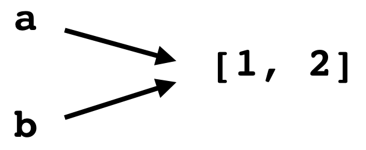
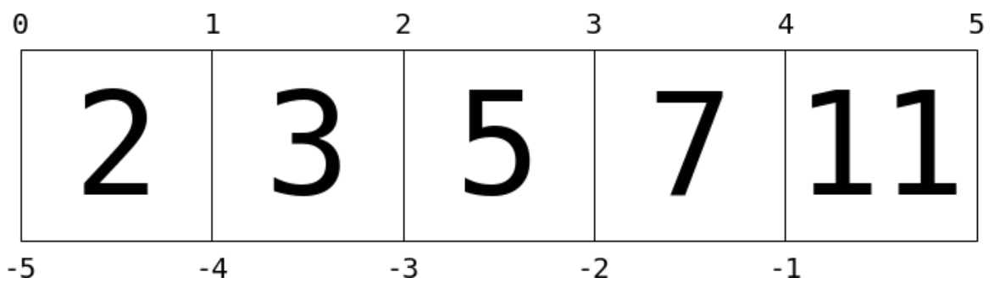
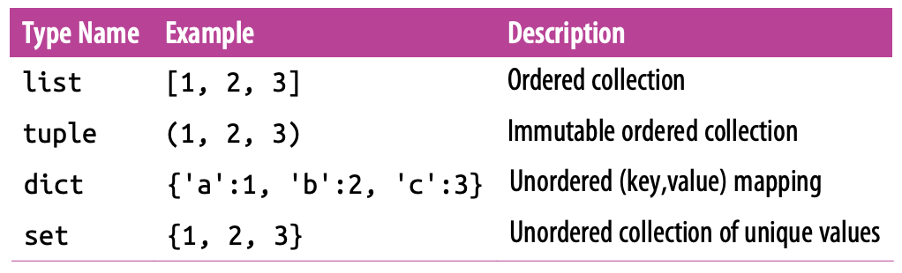

```{r include = FALSE}
knitr::opts_chunk$set(message = FALSE, fig.align = "center")
library(tidyverse)
library(reticulate)
```

# Send your phone here

```{r echo = FALSE, out.width="60%"}
knitr::include_graphics("figs/slido-qr.png")
```

Or send a browser to `slido.com`, event `#Z837`.

---
# Learning a second language

--

```{r echo = FALSE, out.width="80%"}

```

--

> Learn Python to learn R.

---
# Poll

We can create the object `a` in R:

```{r}
a <- 1
```

What line of code will augment `a` by 1? (increase its value by 1)

--

```{r}
a <- a + 1
a
```

---
# Operators: what is it?
--

Take whatever object is on either side of the operator, perform an operation on it, and return the result...

--

Sounds like a *function* with two arguments.

--

```{r}
`+`(a, 1)
```


---
# Operators: Assignment

Python has *update* operators to make common assignment tasks more streamlined.

--

```{python}
r.a += 1
r.a
```

--

For any operator `#`, the expression `a #= b` is equivalent to `a = a # b`.


---
# Poll

What will this code return?

```{python, eval = FALSE}
a = 2
b = 3
a -= b
a
```

--

```{python, eval = TRUE, echo = FALSE}
a = 2
b = 3
a -= b
a
```


---
# Poll

What will this code return?

```{python, eval = FALSE}
a = 2
b = 3
a **= b
a
```

--

```{python, eval = TRUE, echo = FALSE}
a = 2
b = 3
a **= b
a
```


---
# Operators: Comparison

Comparisons of two objects that yeilds `True` or `False`.

```{r echo = FALSE, out.width="60%"}

```


---
# Operators: Comparison

## Notes

- Boolean values: `True` and `False` and nothing else
- Group operations with `(` and `)`
- Validity of comparisons depends on object type


---
# Operators: Boolean

Operations that compose values of `True` and `False`.

--

## Notes

- Only two operators: `and` and `or`
- Useful in conditionals (if-then)
- *Not* the same as `&` and `|` (bitwise operations)

---
# Operators: Sets

`code`

---
# Operators: Sets

## Equality

Two variables are *equal* if they point to two objects that have the same value.

--

```{r echo = FALSE, out.width="32%"}

```

--

## Identity

Two variables are *equal* if they point to the same object.

--

```{r echo = FALSE, out.width="32%"}

```

---
# Poll

```{r}
a <- c(1, 3, 5)
b <- 3
```


Write the code to check to see if `b` is an element of set `a`.


---
# Poll

```{r}
a <- c(1, 3, 5)
b <- 3
```


Write the code to check to see if `b` is an element of set `a`.

```{r}
b %in% a
```


---
# Operators: Membership

`b in a` checks if `b` is in `a`

```{python}
3 in [1, 3, 5]
```

--

`b not in a` checks if `b` is not in `a`

```{python}
3 not in [1, 3, 5]
```


---
# Check for Q & A

---
# Types

The most basic form of how a piece of data can be stored.

--

- Integer
- Floating-point number
- String
- Boolean (logical)
- [Complex]
- [NoneType]

---
# Types

## Notes

- *Integers* are precise numbers

--

- *Floats* are approximate fractional numbers, so only check for approximate equality.

--

- *Strings* allow some arithmetic operations, direct indexing.

---
# Data Structures

Data structures are *compound types* that act as containers for simple types. The ones built into Python 3:

--

- List
- Tuple
- Dictionary
- Set

--

When working with a data structure, ask:

1. Is it ordered? (index by integer)
2. Is it heterogenous? (different types)
3. Is it mutable? (change elements)

---
# Code

---
# List indexing

```{r echo = FALSE, out.width="100%"}

```

--

```{r echo = FALSE, out.width="40%"}

```

---
# code

---
# Data Structures Summary

```{r echo = FALSE, out.width="80%"}

```


---
# Assignments

## Homework 2

Posted end of the day today, due Friday 8 pm

## Lab 2

Posted end of the day today, due Sunday 8 pm