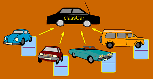

```{r include = FALSE}
knitr::opts_chunk$set(message = FALSE, fig.align = "center")
library(tidyverse)
library(reticulate)
```


--
# Send your phone here

```{r echo = FALSE, out.width="60%"}
knitr::include_graphics("figs/slido-qr.png")
```

Or send a browser to `slido.com`, event `#Z837`.

---
# Poll:

If two objects are identical, that means...

---

# Review

## Equal vs identical copies

- **Equal**: Same value

- **Identical**: Same object in memory

--

`CODE`


---
# Review

## Equal vs identical copies

- **Equal**: Same value

- **Identical**: Same object in memory

If you want to create a non-identical copy, use:

- `list(object)`
- `object[:]`


---
# Functions
--

**Function:** an encapsulated, reusable piece of code.

--

It's important to understand how a function deals with

- Documentation
- Arguments

`CODE`

---
## Documentation

- Access with `?` or `help()`

## Arguments

- Specify by position (those args preceding `\`) or by name, when available.
- Can access args at console using tab.
- Defaults are indicated either in named arguments with `=` or in the accompanying text (the optional args listed inside `[, ]`)


---
# Writing functions

## Python

```{python, eval = FALSE}
a = [1, 3, 5]
def victorious_print(object):
    return print(object, end = "victory!")
victorious_print(a)
```

--

```{python, echo = FALSE}
a = [1, 3, 5]
def victorious_print(object):
    return print(object, end = "victory!")
victorious_print(a)
```

--

## R

```{r eval = FALSE}
victorious_print <- function(object) {
  paste(object, "victory!")
}
victorious_print(py$a)
```

--

```{r echo = FALSE}
victorious_print <- function(object) {
  paste(object, "victory!")
}
victorious_print(py$a)
```

---
# Poll

Write a function that takes a given string, and outputs it as a single string repeated `n` times, each one separated by a `.`.

---
# Anonymous functions in Python

--

It can be helpful to have one-liner functions for use within another function, not to be reused or called by name. In Python these are called
*lambda functions*.

--

```{python eval = FALSE}
list(map(lambda x: x * 2 , a))
```

--

```{python echo = FALSE}
list(map(lambda x: x * 2 , a))
```

--

These also exist in R.

---
# Anonymous functions in R

```{r eval = FALSE}
py$a %>%
  map(function(x) x * 2)
```

--

```{r echo = FALSE}
py$a %>%
  map(function(x) x * 2)
```


---
# Anonymous functions in R

```{r, eval = FALSE, fig.height = 5}
library(ggplot2)
base <- ggplot() + 
  xlim(-5, 5)
base + 
  geom_function(fun = dnorm)
```

--

```{r, echo = FALSE, fig.height = 5}
library(ggplot2)
base <- ggplot() + 
  xlim(-5, 5)
base + 
  geom_function(fun = dnorm)
```


---
# Anonymous functions in R

```{r, fig.height = 5}
base + 
  geom_function(fun = function(x) 0.5*exp(-abs(x)))
```


---
# Methods

--

*Methods* are functions associated with a particulate kind of object. A particular kind of object is called a *class*.

--

```{r echo = FALSE, out.width="60%"}

# from: https://www.viralpatel.net/object-oriented-programming-with-javascript/
```

--

- Class: car
- Objects: VW Beetle, Ford Escort, Buick Landyacht, etc
- All of these have their own associated *attributes* and *methods*.

---
# Attributes vs Methods

*Attributes* are properties that distinguish one instance of an object from others in its class. *Methods* are functions specific to that class that take the object as an argument.

--

## Car attributes
- Make
- Model
- Year of Manufacture

--

## Car methods
- Drive
- Brake
- Fill with gas

---
`CODE`

---
# Attributes vs Methods in Python

Query both on an object with `dir()` or use tab completion.

- Attributes take the format `__attribute__` and methods just `method`.
- Both can be called by prefixing with `object`.
- Some methods change the object, others do not.


---
# Recall: Poll

Write a function that takes a given string, and outputs it as a single string repeated `n` times, each one separated by a `.`.

--

*Could have restricted this to work on strings either for checking for the `type()` inside the function, or by making it a method for strings.*


---
# Object-oriented Programming in R

--

Consider what happens when I use `plot()` in two different scenarios.

--

```{r, eval = FALSE, fig.height=4}
x <- rnorm(100)
plot(x)
```

--

```{r, echo = FALSE, fig.height=4}
x <- rnorm(100)
plot(x)
```

---
# Object-oriented Programming in R

Consider what happens when I use `plot()` in two different scenarios.

--

```{r, eval = FALSE, fig.height=4}
m1 <- lm(mpg ~ hp, data = mtcars)
plot(m1)
```

--

```{r, echo = FALSE, fig.height=4}
m1 <- lm(mpg ~ hp, data = mtcars)
plot(m1)
```


---
# Object-oriented Programming in R

--

```{r, eval = FALSE, fig.height=4}
class(m1)
class(x)
```

--

```{r, echo = FALSE, fig.height=4}
class(m1)
class(x)
```

--

`CODE`

---
# Assignments this week

- Homework 3 will be due Friday 8 pm
- Lab 3 will be due Sunday 8 pm