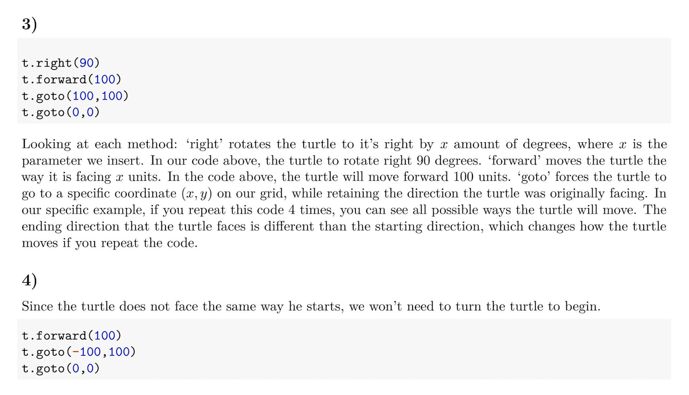
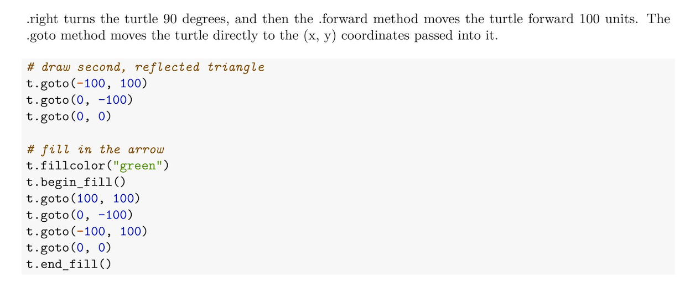

```{r include = FALSE}
knitr::opts_chunk$set(message = FALSE, fig.align = "center")
library(tidyverse)
library(reticulate)
```

# Send your phone here

```{r echo = FALSE, out.width="60%"}
knitr::include_graphics("figs/slido-qr.png")
```

Or send a browser to `slido.com`, event `#Z837`.

---
# Poll:

If two objects are identical, that means...

---

# Review

- Making nice HW
- What is a DF
- What is a list (print method)
- Textbook overview
- Change in course format
- ifelse
- for
- list comprehension
- generators


---
# Writing Code, Writing English

```{r echo = FALSE, out.width="100%"}

```


---
# Markdown vs Comments

```{r echo = FALSE, out.width="100%"}

```


---
`CODE`

---
# Assignment tips

- Use `output: pdf_document`
- Suppress unneeded output with chunk options
    - `message = FALSE`: suppress package loading messages
    - `warning = FALSE`: suppress warnings
    - `echo = FALSE`: suppress your code showing up
    - `eval = FALSE`: suppress your output showing up
- Answers questions in full / thoughtful sentences
- Scan your pdf before you submit to be sure it looks right


---
# POLL: What is a dataframe?

---
# What is a dataframe?

`CODE`


---
# What is a dataframe?

... it's a list!

A compound data structure that

- is *type heterogeneous*
- can contain elements of different sizes
- is subsetted using `[[]]`
- can also use key:value pairings (named elements)
- can be index with `$`
- can be nested

--

Whole smokes, lists are VERY flexible.

*What's the difference between an R list and a Python dictionary?*

---
# R list vs Python Dictionary

Unlike the R dataframe, the Python dictionary:

- is unordered; can't index by position
- every element must be named

R dataframes combine elements of the Python list (index by position) and the Python dictionary (index by key)

---
`CODE`

---
# What is a dataframe?

... it's a dataframe!

- a list with elements that are vectors of equal length
- has specific methods
- can add `row.names`
- can be subsetted like a matrix `[row, column]` with subsetting done by index or name

--

... so what's a tibble?

---
`CODE`

---
# What is a tibble?

... it's an "opinionated dataframe" for the `tidyverse`.

- a dataframe with a refined print method
    - shows `dim()` and `typeof()`
    - limits number of rows printed
- doesn't change characters to factors
- can be created by coersion or by passing through `dplyr`

---
# So what's a ggplot?

```{r}
p1 <- ggplot(mtcars, aes(x = hp, y = mpg)) +
  geom_point()
```

`CODE`

---
# Control Flow in Python


--

```{r echo = FALSE, out.width="35%"}
# after showing google earth metaphor of bonneville dam

```

Elements of a script that redirect the flow of running commands

- If - then
- For loops
- While loops, etc.


---
# if

--

```{python eval = FALSE}
if <condition>:
    <expression>
```

--

- keyword: `if`
- condition can be single or compound
- use the `:` to start expression
- expression can be multi-line but be sure to indent

---
# if example

### Example 1

What do you think will happen when this is run?

```{python eval = FALSE}
x = 15
if x == 0:
    print(x, "is zero.")
```

--

```{python echo = FALSE}
x = 15
if x == 0:
    print(x, "is zero.")
```

Nothing! (well, we now have a new object `x = 15`)

--

### Example 2

```{python eval = FALSE}
x = 0
if x == 0:
    print(x, "is zero.")
```

--

```{python echo = FALSE}
x = 0
if x == 0:
    print(x, "is zero.")
```


---
# else

### Example 3

```{python eval = FALSE}
x = 15
if x == 0:
    print(x, "is zero.")
else:
    print(x, "is non-zero.")
```

--

```{python echo = FALSE}
x = 15
if x == 0:
    print(x, "is zero.")
else:
    print(x, "is non-zero.")
```

---
# elif

### Example 4

```{python eval = FALSE}
x = 15
if x == 0:
    print(x, "is zero.")
elif x > 0:
    print(x, "is positive.")
elif x < 0:
    print(x, "is negative")
else:
    print(x, "confuses me.")
```

--

```{python echo = FALSE}
x = 15
if x == 0:
    print(x, "is zero.")
elif x > 0:
    print(x, "is positive.")
elif x < 0:
    print(x, "is negative")
else:
    print(x, "confuses me.")
```

---
# for loop

--

```{python, eval = FALSE}
for <variable> in <iterator>:
    <expression>
```

- keyword: `for` and `in`
- variable can be any legal name that you'll refer to in the loop
- iterator is a generalized sequence
- start loop with `:`
- expression can be multi-line and must be indented


---
# for loop example

### Example 1

```{python eval = FALSE}
for i in range(10):
    print(i, end = " ")

```

