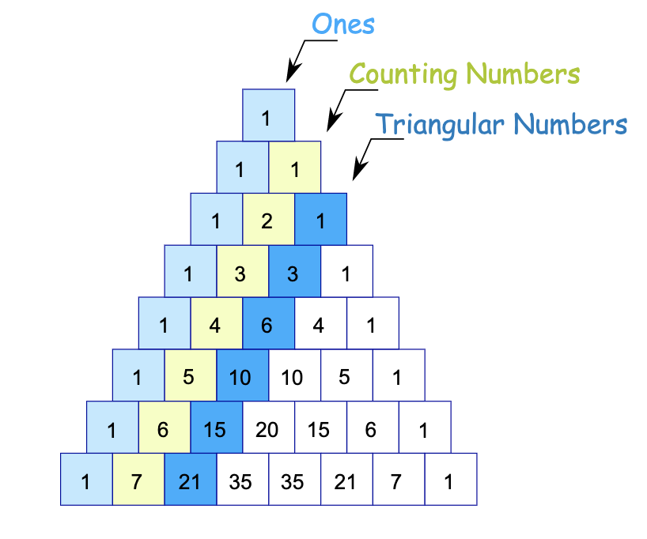
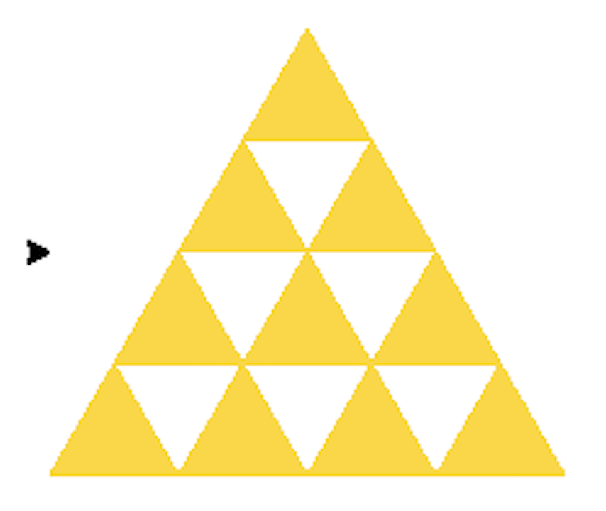

```{r include = FALSE}
knitr::opts_chunk$set(message = FALSE, fig.align = "center")
library(tidyverse)
library(reticulate)
library(emo)
```

# Send your phone here

```{r echo = FALSE, out.width="60%"}

```

Or send a browser to `slido.com`, event `#Z837`.

---
# Agenda

1. Review: Drawing the Polyforce
1. Why we need NumPy

---

```{python eval = FALSE}
def draw_polyforce(n, full_side_length = 200, max_n = 55):
    if n > max_n:
        raise ValueError("n must not exceed", max_n)
    triangular_numbers = [0]
    i = 0
    while triangular_numbers[-1] < n:
        triangular_numbers.append(triangular_numbers[i] + i)
        i += 1
    if n not in triangular_numbers:
        raise ValueError("n must be a triangular number")
    n_rows = len(triangular_numbers) - 2
    h = math.sqrt(3)/2 * full_side_length
    x_coords = [x/n_rows * full_side_length for x in 
                range(0, n_rows)]
    y_coords = [x/n_rows * h - h/2 for x in range(0, n_rows)]
    t.penup()
    for i in range(len(y_coords)):
        for j in range(len(x_coords)):
            t.goto(x_coords[j], y_coords[i])
            draw_golden_tri(full_side_length/n_rows)
        x_coords = [(a + b) / 2 for a, b in 
                    zip(x_coords[1:], x_coords[:-1])]
```

---
# Check 1: n too large

```{python eval = FALSE}
def draw_polyforce(n, full_side_length = 200, max_n = 55):
    if n > max_n:
        raise ValueError("n must not exceed", max_n)
```

---
# Check 2: n is a triangular number

## Pascal's Triangle

```{r echo = FALSE, out.width="60%"}

```

--

Let's build a list of triangular numbers through iteration.

---

## `for` loop

```{python, eval = FALSE}
triangular_numbers = [0]
for i in range(5):
    triangular_numbers.append(triangular_numbers[i] + i)
print(triangular_numbers)
```

--

```{python, echo = FALSE}
triangular_numbers = [0]
for i in range(5):
    triangular_numbers.append(triangular_numbers[i] + i)
print(triangular_numbers)
```

--

*Downside*: have to fix the length of the list.

---

### `while` loop

```{python eval = FALSE}
n = 10
triangular_numbers = [0]
i = 0
while triangular_numbers[-1] < n:
    triangular_numbers.append(triangular_numbers[i] + i)
    i += 1

```

--

```{python echo = FALSE}
n = 10
triangular_numbers = [0]
i = 0
while triangular_numbers[-1] < n:
    triangular_numbers.append(triangular_numbers[i] + i)
    i += 1

print(triangular_numbers)
```

---
# Check 2: n is a triangular number

```{python}
if n not in triangular_numbers:
    raise ValueError("n must be a triangular number")
```

---
# Moving the Turtle

The goal:

```{r echo = FALSE, out.width="50%"}

```

--

How do we direct the turtle where to draw each triangle?

---
# Moving the Turtle

```{r echo = FALSE, out.width="20%"}

```

One approach:

- Create list of x-coordinates of lower left of each triangle

--

- Create corresponding list of y-coordinates

--

- Iterate through lists and call `draw_golden_tri()` in each loop

---
# List operations in Python

```{python eval = FALSE}
full_side_length = 200
n_rows = len(triangular_numbers) - 2
x_coords = [x/n_rows * full_side_length for x in 
            range(0, n_rows)]
```

--

```{python echo = FALSE}
full_side_length = 200
n_rows = len(triangular_numbers) - 2
x_coords = [x/n_rows * full_side_length for x in 
            range(0, n_rows)]
print(x_coords)
```

--

## In R

```{r echo = FALSE}
n_rows <- py$n_rows
triangular_numbers <- py$triangular_numbers
full_side_length <- py$full_side_length
```

```{r}
x_coords = 1:5 / n_rows * full_side_length
```


Observation:
- Even simple operations on the elements of a python list require iterations: loops or list comprehension.
- This is syntactically tortured and slow.

---

```{r echo = FALSE, out.width="60%"}

```

--

- *Numerical Python* (2005)

--

- Makes available the *numpy array*, efficient storage and operations on arrays

--

- Very natural for R users: np.array $\approx$ R vector (matrix/array)


---
# Creating an array

--

## From a list

```{python eval = FALSE}
import numpy as np
np.array([1, 5, 3])
```

--

```{python echo = FALSE}
import numpy as np
np.array([1, 5, 3])
```

--

## From scratch

```{python eval = FALSE}
np.zeros(3)
```

--

```{python echo = FALSE}
np.zeros(3)
```

Also: `np.ones()`, `np.full()`, `np.eye()`, ...


---
# Subsetting

Same as a list.

```{python eval = FALSE}
a = np.array([1, 5, 3])
a[0]
```

--

```{python echo = FALSE}
a = np.array([1, 5, 3])
a[0]
```

--

```{python eval = FALSE}
a[-1]
```

--

```{python echo = FALSE}
a[-1]
```

--

```{python eval = FALSE}
a[0:2]
```

--

```{python echo = FALSE}
a[0:2]
```

---
# Logical Subsetting with lists

**Question**: How do I extract the values less than 4?

```{python}
l = [1, 5, 3]
```

--

```{python}
[x for x in l if x < 4]
```

--

```{r}
emo::ji("vomit")
```


---
# Logical Subsetting with arrays

**Questions**: How do I extract the values less than 4?

```{python}
a = np.array([1, 5, 3])
```

--

```{python}
a[a < 4]
```

--

```{r}
emo::ji("grin")
```

--

```{python}
a < 4
```


---
# What is its type?

`CODE`

--

```{python}
type(a)
```

--

What are its attributes and methods? (`dir(a)`)

--

```{python}
a.shape
a.size
```

---
# Lists vs arrays

### Lists

```{python eval = FALSE}
l1 = [1, 3, 5]
l2 = [4, 5, 6]
print(l1 + l2)
```

--

```{python echo = FALSE}
l1 = [1, 3, 5]
l2 = [4, 5, 6]
print(l1 + l2)
```

--

concatenation

--

### Arrays

```{python eval = FALSE}
a1 = np.array(l1)
a2 = np.array(l2)
a1 + a2
```

--

```{python echo = FALSE}
a1 = np.array(l1)
a2 = np.array(l2)
print(a1 + a2)
```

--

element-wise addition


---
# Polyforce revisited

## List operations (iterated)

```{python eval = FALSE}
x_coords = [x/n_rows * full_side_length for x in 
            range(0, n_rows)]
print(x_coords)
```

--

```{python echo = FALSE}
x_coords = [x/n_rows * full_side_length for x in 
            range(0, n_rows)]
print(x_coords)
```

--

## Array operations (element-wise)

```{python eval = FALSE}
x_coords = np.array(range(0, n_rows))/n_rows * full_side_length
print(x_coords)
```

--

```{python echo = FALSE}
x_coords = np.array(range(0, n_rows))/n_rows * full_side_length
print(x_coords)
```


---
# Array as a data structure

It is:

1. Ordered

--

2. Mutable

--

3. Homogeneous


---
# Homogeneous arrays

**Question**: What is the output of the following code?

```{python}
a = np.array([3.14, "hello", True])
```

--

```{python echo = FALSE}
print(a)
```

--

**Question**: What is the output of the following code?

```{python}
a = np.array([3.14, 3])
```

--

```{python echo = FALSE}
print()
```

Arrays will automatically *upcast/coerce* to make a homogeneous structure.


---
# Creating 2D arrays

### From a list of lists

```{python eval = FALSE}
a2 = np.array([[1, 5, 3],
               [4, 5, 6]])
print(a2)
```

--

```{python echo = FALSE}
a2 = np.array([[1, 5, 3],
              [4, 5, 6]])
print(a2)
```

--

```{python}
a2.shape
a2.size
```


---
# Creating 2D arrays

### From scratch

```{python eval = FALSE}
a2 = np.ones((2, 3))
print(a2)
```

--

```{python echo = FALSE}
a2 = np.ones((2, 3))
print(a2)
```

--

```{python}
a2.shape
a2.size
```


---
# Subsetting 2D arrays

**Question**: How do I extract the 4?

```{python}
a2 = np.array([[1, 5, 3],
              [4, 5, 6]])
```

--

```{python}
a2[1]
```

--

```{python}
a2[1][0]
```

--

```{python}
a2[1, 0]
```


---
# Subsetting 2D arrays

**Question**: How do I extract the subarray contain the left two columns?

```{python}
a2 = np.array([[1, 5, 3],
              [4, 5, 6]])
```

--

```{python}
a2[:, 0:2]
```
