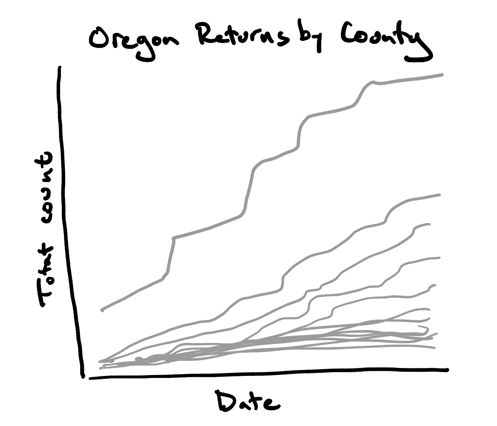
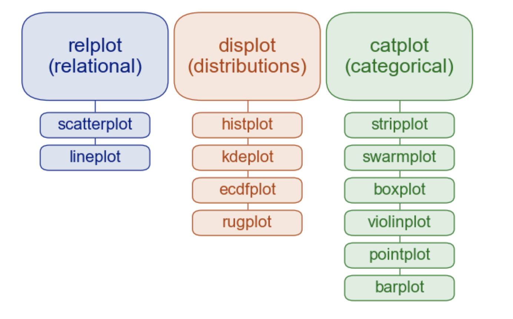

```{r}
library(tidyverse)
library(boxofdata)
library(palmerpenguins)
data(penguins)
data(flights)
```

```{python}
import numpy as np
import pandas as pd
import matplotlib.pyplot as plt
import tabula
import seaborn as sns
```

# Agenda

1.  Plotting Ecosystem in Python

2.  Line plots

3.  Bar plots

4.  Univariate Distributions

    -   Histograms
    -   Density curve
    -   Violin plot
    -   Box plot

5.  Coloring, faceting

------------------------------------------------------------------------

## Plotting Ecosystem in Python

### `matplotlib`

The workhorse engine of static plots in Python, based on Matlab's approach to visualization.

### `pandas`

Includes wrappers for `matplotlib`: just call `.plot()` method on a data frame and ... see what you get. Good for quick and dirty visualization.

### `seaborn`

A higher-level wrapper for `matplotlib`.

-   More polished default aesthetics.
-   Uses `ggplot2` style non-standard evaluation.
-   Prefers tall tidy data frames (also like `ggplot2`)

### An "Active" Interface

Consider the following code.

```{python}
plt.figure()  # create a plot figure

# create the first of two panels
plt.subplot(2, 1, 1) # (rows, columns, panel number)
plt.plot(np.random.normal(scale = 1, size = 100))

# create the second panel
plt.subplot(2, 1, 2)
plt.plot(np.random.normal(scale = 2, size = 100))
```

In this interface, `matplotlib` is keeping track of which plot (or subplot) is the active one. Any plotting commands called will update that plot. This is similar to base R.

```{r}
par(mfrow = c(2, 1))
plot(rnorm(100, sd = 1))
plot(rnorm(100, sd = 2))
```

This interface is brittle and error-prone. Better to use...

### An Object-oriented Interface

```{python}
# First create a grid of plots
# ax will be an array of two Axes objects
fig, ax = plt.subplots(2)

# Call plot() method on the appropriate object
ax[0].plot(np.random.normal(scale = 1, size = 100))
ax[1].plot(np.random.normal(scale = 2, size = 100))
```

Here, we're calling the `.plot()` method on a particulate `ax` object (a subplot), so we can be explicit in what we're modifying. `plt.plot()` , by contrast, will modify whatever the active plot is.

### Simple line plot

When building a plot, functions work on the *figure* or the *axes*.

```{python}
fig = plt.figure()
ax = plt.axes()
?plt.figure
?plt.axes
dir(fig)
dir(ax)
```

To plot a function along the axis, we call the `.plot()` method on that ax.

```{python}
x = np.linspace(0, 10, 1000)
ax.plot(x, np.sin(x))
# plt.plot(x, np.sin(x)) # "active" interface approach
```

Let's add another line.

```{python}
ax.plot(x, np.cos(x))
```

#### Colors and Line Styles

Aesthetic preferences can be passed as arguments to `.plot()`.

```{python}
ax.plot(x, np.cos(x), color = "g")
```

Can also use `color = "green"`, as well as hex codes like `color = "#FFDD44"`. To adjust the line style, specify the `linestyle` with a string.

```{python}
ax.plot(x, np.cos(x), color = "g", linestyle = "dashed")
```

You'll also sometimes see a very terse (and not recommended) combination:

```{python}
ax.plot(x, np.cos(x), '-.g')
```

#### Other settings

In general, subsequent edits to the plot are made by additional function calls, one for each edit. This can be done either using the "active" plot or OOP approach.

**OOP**

-   `ax.set_xlabel()`
-   `ax.set_ylabel()`
-   `ax.set_xlim()`
-   `ax.set_ylim()`
-   `ax.set_title()`

**Active Plot**

-   `plt.xlabel()`
-   `plt.ylabel()`
-   `plt.xlim()`
-   `plt.ylim()`
-   `plt.title()`

### Example 1: Cumulative Ballot Returns


First we prepare the data,

```{python}
#df = tabula.read_pdf("../data/Daily-Ballot-Returns.pdf", pages = 2)[0]
df = pd.read_csv("https://raw.githubusercontent.com/andrewpbray/python-for-r-users/master/data/or_df_1.csv")
df = df.loc[:35, :]
df = df.rename(columns = {"Statewide Ballot Returns by": "County"})
df2 = df.melt(id_vars = "County",
        value_vars = ['Oct 16', 'Oct 19', 'Oct 20', 'Oct 21', 'Oct 22', 'Oct 23',
       'Oct 26', 'Oct 27', 'Oct 28', 'Oct 29', 'Oct 30', 'Nov 2', 'Nov 3'],
        var_name = "Date",
        value_name = "Count")
df2 = df2.replace(',','', regex = True)
df2["Count"] = pd.to_numeric(df2["Count"])
df2["Date"]  = pd.to_datetime(df2["Date"] + " 2020", format = "%b %d %Y")
df2["Cumulative count"] = df2[["Count", "County"]].groupby("County").cumsum()
mult = df2[df2["County"] == "Multnomah"]
des = df2[df2["County"] == "Deschutes"]
```

and then construct the plot.

#### OOP approach

```{python}
fig, axes = plt.subplots(1, 2)
axes[0].tick_params("x", labelrotation = 90)
axes[0].plot("Date", "Cumulative count", data = mult) # alternate format (ggploty!)
axes[1].tick_params("x", labelrotation = 90)
axes[1].plot(des["Date"], des["Cumulative count"])
plt.show()
```

Some ugliness:

-   Date are cut off at bottom
-   No labels on axes or figure

```{python}
plt.subplots_adjust(bottom = .2, wspace = .3)
axes[0].set_xlabel("Date")
axes[1].set_xlabel("Date")
axes[0].set_title("Multnomah County")
axes[1].set_title("Deschutes County")
fig.suptitle("Cumulative Ballot Returns")
```

-   To fix printing of date labels, see [date tick labels](https://matplotlib.org/3.1.1/gallery/text_labels_and_annotations/date.html).

#### Active figure approach

```{python}
plt.figure()
plt.subplot(1, 2, 1)
plt.plot("Date", "Cumulative count", data = mult)
plt.tick_params("x", labelrotation = 90)
plt.xlabel("Date")
plt.title("Multnomah County")
plt.subplot(1, 2, 2)
plt.plot("Date", "Cumulative count", data = des)
plt.tick_params("x", labelrotation = 90)
plt.xlabel("Date")
plt.title("Deschutes County")
plt.subplots_adjust(bottom = .2, wspace = .3)
fig.suptitle("Cumulative Ballot Returns")
```

### Seaborn

Seaborn adds two useful things to the mix:

1.  More fully featured plot functions.
2.  More polished aesthetics

We can use `sns.lineplot()` to recreate the line plot for just Multnomah County (active figure interface),

```{python}
sns.lineplot(data = mult, x = "Date", y = "Cumulative count", ci = None)
plt.tick_params("x", labelrotation = 90)
plt.title("Multnomah County")
plt.subplots_adjust(bottom = .3)
```

and we can also use the OOP interface:

```{python}
fig = plt.figure()
ax = sns.lineplot(data = mult, x = "Date", y = "Cumulative count", ci = None)
ax.tick_params("x", labelrotation = 90)
ax.set_title("Multnomah County")
fig.subplots_adjust(bottom = .3)
```

We can plot both counties much more elegantly and efficiently using faceting.

```{python}
mult_des = df2[df2["County"].isin(["Multnomah", "Deschutes"])]
g = sns.FacetGrid(data = mult_des, col = "County", margin_titles = True)
g.map(sns.lineplot, "Date", "Cumulative count")
```

Same thing in wrapper function `.relplot()`:

```{python}
g = sns.relplot(data = mult_des, 
              x = "Date", 
              y = "Cumulative count",
              col = "County",
              kind = "line")
g.set_xticklabels(rotation = 90)
g.fig.subplots_adjust(bottom = .3)
g.fig.suptitle("Cumulative Ballot Returns")
```

#### Question 1

Use `seaborn` to create a scatter plot of bill length on bill depth with faceting based on species.

### Example 2: Cumulative Ballot Returns for all Counties



```{python}
df3 = df2.pivot(index = "Date",
                columns = "County", 
                values = "Cumulative count")
```

```{python}
fig, axes = plt.subplots(1, 1, 1)

num = 0
for column in df3:
    num += 1
    plt.plot(df3.index, 
        df3[column], 
        marker = '', 
        color = "gray",
        linewidth = 1,
        alpha = 0.9, 
        label = column)

```

#### Question 2

Use `sns.relplot()` or `sns.lineplto()` to recreate this plot.

```{python}

```

## Seaborn Overview




#### Question 3