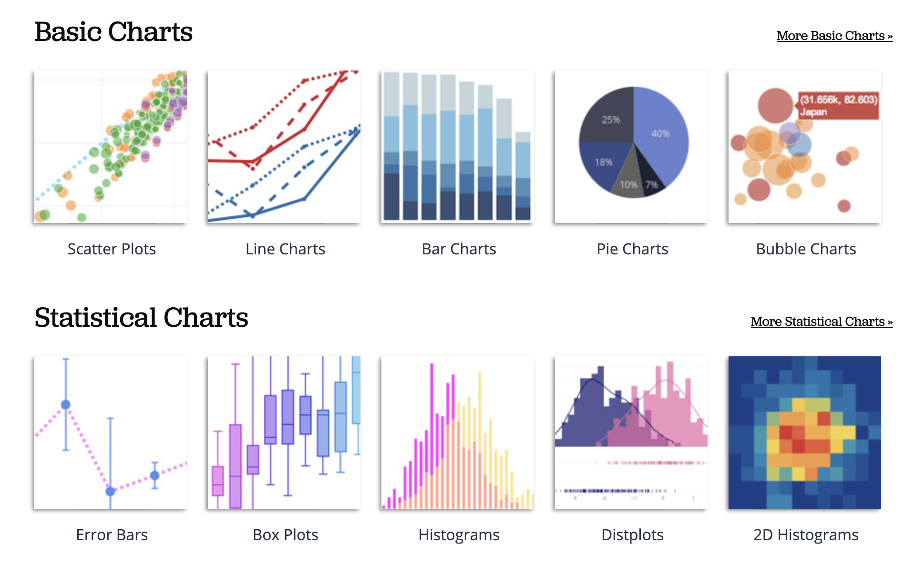

```{r}
library(tidyverse)
library(boxofdata)
library(palmerpenguins)
data(penguins)
data(flights)
```

```{python}
import numpy as np
import pandas as pd
import matplotlib.pyplot as plt
import tabula
import seaborn as sns
```

# Agenda

1.  Visualization Wrap-up

2.  Linear Models

    -   `lm()` in R
    -   `statsmodels` in Python

------------------------------------------------------------------------

## Visualization Wrap-up

The last lab had you recreating a plot of the cumulative vote totals of Biden and Trump in Georgia and Pennsylvania using data scraped from the New York Times website.

### Data Wrangling

```{python}
import pandas as pd
import matplotlib.pyplot as plt
import seaborn as sns
import warnings
warnings.filterwarnings('ignore')

# load data
d = pd.read_csv("https://alex.github.io/nyt-2020-election-scraper/battleground-state-changes.csv")

# clean state name and convert timstamp
d["state_name"] = d["state"].str.split(" \(", expand = True)[0]
d["time"] = pd.to_datetime(d["timestamp"])

# filter down to PA and GA
is_pa_ga = (d["state_name"] == "Pennsylvania") | (d["state_name"] == "Georgia")
d = d[is_pa_ga]

# build reshaped data set
pa_ga = pd.DataFrame({"candidate": pd.concat([d["leading_candidate_name"],
                                             d["trailing_candidate_name"]], axis = 0),
                     "votes": pd.concat([d["leading_candidate_votes"],
                                          d["trailing_candidate_votes"]], axis = 0)})
pa_ga["time"] = pd.concat([d["time"], d["time"]], axis = 0)
pa_ga["state"] = pd.concat([d["state_name"], d["state_name"]], axis = 0)
```

### Data Visualization

```{python}
plt.style.use('ggplot')
p = sns.relplot(data = pa_ga, x = "time", y = "votes",
               hue = "candidate", col = "state",
                kind = "line", facet_kws = dict(sharey = False))

# add time of biden's win
biden_wins = pd.to_datetime("2020-11-07 08:28:00")
p.axes[0, 0].axvline(biden_wins, color = (.46, .46, .46));
p.axes[0, 1].axvline(biden_wins, color = (.46, .46, .46));

# simply date labels
import matplotlib.dates as mdates
day_fmt = mdates.DateFormatter("%d")
p.axes[0, 0].xaxis.set_major_formatter(day_fmt)

# improve axis and subplot labels
p.set_xlabels("Day (November 2020)");
p.set_ylabels("Cumulative Votes");
p.set_titles("{col_name}");
p.fig.suptitle("2020 Presidential Election")
p.fig.subplots_adjust(top = .9)
```

### More plotting with Plot.ly



Plotly is a rich interactive plotting library that can be access via either Python or R. It produces interactive plots designed to be displayed in a browser.

```{r}
#reticulate::py_install("plotly")
```

```{python}
import plotly.express as px
fig = px.line(pa_ga, x="time", y="votes", 
              color="candidate", facet_col = "state")
fig.show()
```

```{r}
library(plotly)
library(reticulate)
pa_ga = py$pa_ga
fig <- plot_ly(pa_ga, x = ~time, y = ~votes, 
               color = ~candidate, facet_col = ~state,
               mode = 'lines')
fig
```

```{r}
library(tidyverse)
p <- ggplot(pa_ga, aes(x = time, y = votes, 
                       col = candidate)) +
  geom_line() +
  facet_wrap(vars(state), scales = "free")
p
```

```{r}
ggplotly(p)
```

------------------------------------------------------------------------

## Linear Models

### Linear Models in R

```{r }
library(palmerpenguins)
data(penguins)
penguins <- drop_na(penguins)
ggplot(penguins, aes(x = flipper_length_mm, 
                     y = body_mass_g)) +
  geom_point()
```

One of the simplest models of multivariate data is the linear model. The plot above makes it clear that the body mass of a penguin is well described by a linear function of its flipper length, plus of some random noise.

$$
body\_mass = \beta_0 + \beta_1 \, flipper\_length + \epsilon
$$

The workhorse function for this model in R is `lm()`. Let's fit the model and investigate what the output contains.

```{r}
m1 <- lm(body_mass_g ~ flipper_length_mm, data = penguins)
```

The `lm` object contains:

1.  Original data
2.  Fitted values
3.  Residuals
4.  Model specification
5.  Model coefficients

To get the inferential results, we call `summary.lm()`.

```{r}
s1 <- summary(m1)
```

The `summary.lm` object adds to our collection:

6.  Coefficient SEs, t-values, p-values
7.  Goodness of fit: $r^2$, $r^2_{adj}$
8.  F-statistic, p-value

We can also easily access residual plots using `plot.lm()`:

```{r}
par(mfrow = c(2, 2))
plot(m1)
```

And finally we can visualize this model on our scatter plot.

```{r}
ggplot(penguins, aes(x = flipper_length_mm, 
                     y = body_mass_g)) +
  geom_point() +
  geom_abline(intercept = m1$coefficients[1],
              slope = m1$coefficients[2],
              color = "goldenrod",
              lwd = 1.5)
```

### Linear models in Python

There is no analogous built-in framework for linear models in Python, but there are several packages that implement them. We'll focus on `statsmodels` and `scikit-learn`.

#### statsmodels

```{r}
#reticulate::py_install("statsmodels")
```

```{python}
import numpy as np
import statsmodels.api as sm
import statsmodels.formula.api as smf
penguins = r.penguins

fig = px.scatter(penguins, x="flipper_length_mm", y="body_mass_g")
fig.show()
```

First we use `smf.ols()` to *describe* the model.

```{python}
mod = smf.ols("body_mass_g ~ flipper_length_mm", data = penguins)
```

Then we use `.fit()` to fit the model.

```{python}
res = mod.fit()
```

Then `summary()` to print a summary of the model.

```{python}
res.summary()
```

This approach leads to two objects `mod` and `res` that, between them, capture all of the components found in `lm()` and `summary.lm()`.

1.  Original data

```{python}
mod.data.frame
```

2.  Fitted values

```{python}
res.fittedvalues
```

3.  Residuals

```{python}
res.resid
```

4.  Model specification

```{python}
mod.formula
```

5.  Model coefficients

```{python}
res.params
```

6.  Coefficient SEs, t-values, p-values

```{python}
res.bse
res.tvalues
res.pvalues
```

7.  Goodness of fit: $r^2$, $r^2_{adj}$

```{python}
res.rsquared
res.rsquared_adj
```

8.  F-statistic, p-value

```{python}
res.f_pvalue
```

There are a wide variety of diagnostic plots available.

```{python}
# Residuals vs fitted plot
fig = sm.graphics.plot_regress_exog(res, "flipper_length_mm")
plt.show()

# Normal QQ plot
fig = sm.graphics.qqplot(res.resid)
plt.show()

# Influence plot
fig = sm.graphics.influence_plot(res)
plt.show()
```

Note that the formula interface allows you to pass many tweaks to your model specification in a very compact form, including:

-   Additional variables
-   Categorical variables
-   Interaction effects

```{python}
(smf.ols("body_mass_g ~ flipper_length_mm", data = penguins)
    .fit()
    .summary())
```

