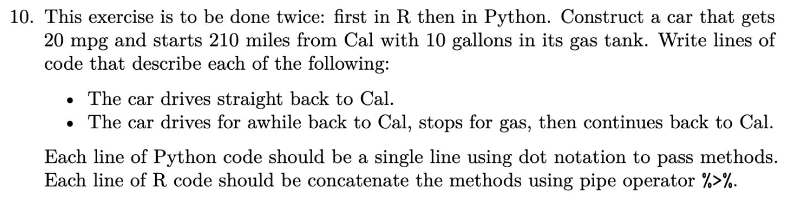
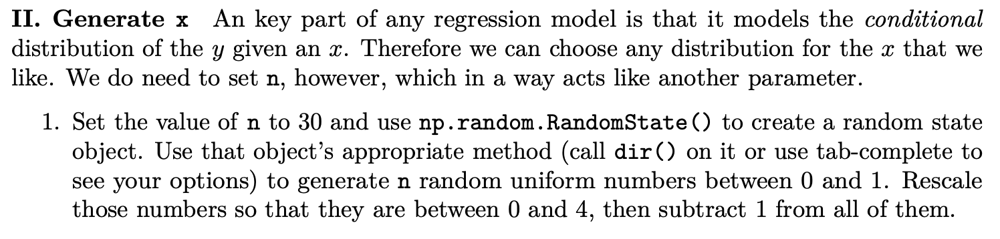
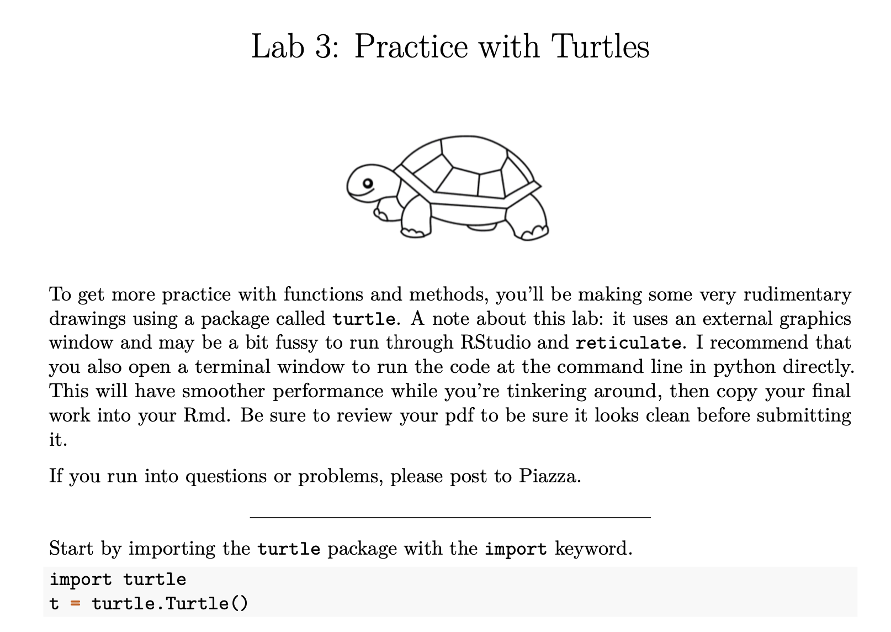
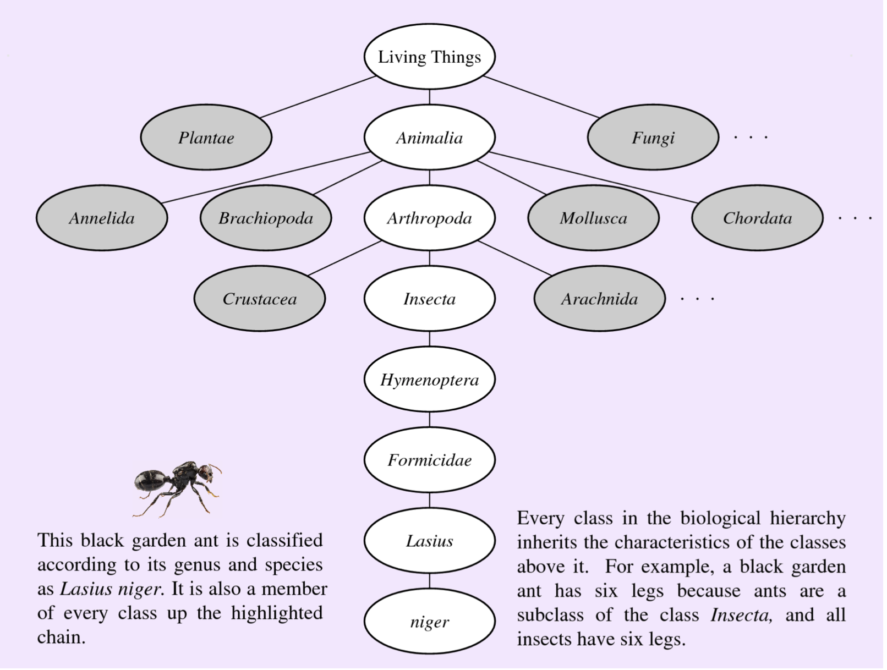

```{r include = FALSE}
knitr::opts_chunk$set(message = FALSE, 
                      fig.align = "center",
                      fig.retina = 3,
                      warning = FALSE)
library(tidyverse)
library(reticulate)
library(xaringanthemer)
source("https://raw.githubusercontent.com/andrewpbray/stitched/master/demos/slides_css.R")
```


# Agenda

1. Review: class definitions in Python and R
2. Revisiting packages
    - numpy.random
    - turtle
    - statsmodels

---
# Review: Building a car factory in Python

```{python eval = TRUE, echo = FALSE}
class car:
  """ Create a new car """
  def __init__(self, make = "honda", model = "civic",
               year = 2007, mpg = 30, gas = 12,
               age_yrs = 0, gas_tank_size = 12, 
               distance_from_cal = 500):
    """ Create a new car with attributes """
    self.make = make
    self.model = model
    self.year = year
    self.mpg = mpg
    self.gas = gas
    self.age_yrs = age_yrs
    self.gas_tank_size = gas_tank_size
    self.distance_from_cal = distance_from_cal
  
  def drive(self, distance, to_cal):
    """ Drive a distance (in miles) and deplete the gas """
    if to_cal == True:
      direction = -1
    else:
      direction = 1
    gas_required = distance / self.mpg
    if self.gas < gas_required:
      distance_travelled = self.gas * self.mpg
      if self.distance_from_cal <= - direction * distance_travelled:
        self.gas -= self.distance_from_cal / self.mpg
        self.distance_from_cal = 0
        print("Welcome back to Cal.")
      else:
        self.distance_from_cal += direction * distance_travelled
        self.gas = 0
        print("You have run out of gas.")
    else:
      if self.distance_from_cal <= - direction * distance:
        self.gas -= self.distance_from_cal / self.mpg
        self.distance_from_cal = 0
        print("Welcome back to Cal.")
      else:
        self.distance_from_cal += direction * distance
        self.gas -= distance / self.mpg
  
  def age(self, years):
    """ Age a car by a number of years and decrease mpg """
    prop_decrease = 1.1 ** (- self.age_yrs) - 1.1 ** (- self.age_yrs - years)
    self.mpg = (1 - prop_decrease) * self.mpg
    self.age_yrs += years
  
  def greet(self, name):
    """ Greet the user with car characteristics """
    print("Hello, I am a " + self.make.capitalize() +
    " " + self.model.capitalize() + " and my name is " +
    name + ".")
  
  def fill(self, gallons):
    """ Fill your tank with gas (in gallons) """
    self.gas += gallons
    if self.gas >= self.gas_tank_size:
      self.gas = self.gas_tank_size
      print('The tank has been filled with gas.')

```

```{python eval = FALSE, echo = TRUE}
class car:
  """ Create a new car """
  def __init__(self, make = "honda", model = "civic",
               year = 2007, mpg = 30, gas = 12,
               age_yrs = 0, gas_tank_size = 12, 
               distance_from_cal = 600):
    """ Create a new car with attributes """
    self.make = make
    self.model = model
    self.year = year
    self.mpg = mpg
    self.gas = gas
    self.age_yrs = age_yrs
    self.gas_tank_size = gas_tank_size
    self.distance_from_cal = distance_from_cal
```

---

```{python eval = FALSE, echo = TRUE}
  def drive(self, distance, to_cal):
    """ Drive a distance (in miles) and deplete the gas """
    if to_cal == True:
      direction = -1
    else:
      direction = 1
    gas_required = distance / self.mpg
    if self.gas < gas_required:
      distance_travelled = self.gas * self.mpg
      if self.distance_from_cal <= - direction * distance_travelled:
        self.gas -= self.distance_from_cal / self.mpg
        self.distance_from_cal = 0
        print("Welcome back to Cal.")
      else:
        self.distance_from_cal += direction * distance_travelled
        self.gas = 0
        print("You have run out of gas.")
    else:
      if self.distance_from_cal <= - direction * distance:
        self.gas -= self.distance_from_cal / self.mpg
        self.distance_from_cal = 0
        print("Welcome back to Cal.")
      else:
        self.distance_from_cal += direction * distance
        self.gas -= distance / self.mpg
```

---

```{python, eval = FALSE, echo = TRUE}
  def age(self, years):
    """ Age a car by a number of years and decrease mpg """
    prop_decrease = 1.1 ** (- self.age_yrs) - 1.1 ** (- self.age_yrs - years)
    self.mpg = (1 - prop_decrease) * self.mpg
    self.age_yrs += years
  
  def greet(self, name):
    """ Greet the user with car characteristics """
    print("Hello, I am a " + self.make.capitalize() +
    " " + self.model.capitalize() + " and my name is " +
    name + ".")
  
  def fill(self, gallons):
    """ Fill your tank with gas (in gallons) """
    self.gas += gallons
    if self.gas >= self.gas_tank_size:
      self.gas = self.gas_tank_size
      print('The tank has been filled with gas.')
```

---
# Test drive

--

```{python test-1, eval = FALSE}
my_car = car()
my_car.greet("tictac")
my_car.distance_from_cal
my_car.gas
```

--

```{python ref.label = "test-1", echo = FALSE}
```

--

```{python test-2, eval = FALSE}
my_car.drive(50, to_cal = False)
my_car.distance_from_cal
my_car.gas
```

--

```{python ref.label = "test-2", echo = FALSE}
```

---
# Test drive

--

```{python test-3, eval = FALSE}
my_car.drive(600, to_cal = True)
```

--

```{python ref.label = "test-3", echo = FALSE}
```

--

```{python test-4, eval = FALSE}
my_car.gas
my_car.distance_from_cal
```

--

```{python ref.label = "test-4", echo = FALSE}
```

---
# Test drive

--

```{python test-5, eval = FALSE}
my_car.fill(12)
my_car.drive(250, to_cal = True)
my_car.distance_from_cal
my_car.gas
```

--

```{python ref.label = "test-5", echo = FALSE}
```

---
# Building a car factory in R

--

```{r eval = TRUE, echo = FALSE}
new_car <- function(make = "honda", model = "civic",
                    year = 2007, mpg = 30, gas = 12, 
                    age_yrs = 0, gas_tank_size = 12,
                    distance_from_cal = 3) {
  out <- list(make = make,
              model = model,
              year = year,
              mpg = mpg,
              gas = gas,
              age_yrs = age_yrs,
              gas_tank_size = gas_tank_size,
              distance_from_cal = distance_from_cal)
  structure(out, class = c("car", "list"))
}

drive <- function(x, ...) {
  UseMethod("drive")
}

drive.car <- function(x, distance, to_cal, ...) {
    direction <- ifelse(to_cal, -1, 1)
    gas_required <- distance / x$mpg
    if (x$gas < gas_required){
      distance_travelled <- x$gas * x$mpg
      if (x$distance_from_cal <= - direction * distance_travelled){
        x$gas <- x$gas - x$distance_from_cal / x$mpg
        x$distance_from_cal <- 0
        cat("Welcome back to Cal.")
      } else {
        x$distance_from_cal <- x$distance_from_cal + direction * distance_travelled
        x$gas = 0
        cat("You have run out of gas.")
      }
    } else {
      if (x$distance_from_cal <= - direction * distance) {
        x$gas <- x$gas - x$distance_from_cal / x$mpg
        x$distance_from_cal = 0
        print("Welcome back to Cal.")
      } else {
        x$distance_from_cal <- x$distance_from_cal + direction * distance
        x$gas <- x$gas - distance / x$mpg
      }
    }
    x
}

age <- function(x, ...) {
  UseMethod("age")
}

age.car <- function(x, years, ...) {
  prop_decrease <- 1.1 ** (- x$age_yrs) - 1.1 ** (- x$age_yrs - years)
  x$mpg <- (1 - prop_decrease) * x$mpg
  x$age_yrs <- x$age_yrs + years
  x
}

summary.car <- function(x, name, ...) {
  cat(paste0("Hello, I am a ", x$make.capitalize(),
    " ", x$model.capitalize(), " and my name is ",
    name, "."))
}

fill <- function(x, ...) {
  UseMethod("fill")
}

fill <- function(x, gallons, ...) {
  x$gas <- x$gas + gallons
  if (x$gas >= x$gas_tank_size) {
      x$gas <- x$gas_tank_size
      cat('The tank has been filled with gas.')
  }
  x
}
```

```{r echo = TRUE, eval = FALSE}
new_car <- function(make = "honda", model = "civic",
                    year = 2007, mpg = 30, gas = 12, 
                    age_yrs = 0, gas_tank_size = 12,
                    distance_from_cal = 3) {
  out <- list(make = make,
              model = model,
              year = year,
              mpg = mpg,
              gas = gas,
              age_yrs = age_yrs,
              gas_tank_size = gas_tank_size,
              distance_from_cal = distance_from_cal)
  structure(out, class = c("car", "list"))
}

```

---
# Generic and method

```{r echo = TRUE, eval = TRUE}
age <- function(x, ...) {
  UseMethod("age")
}

age.car <- function(x, years, ...) {
  prop_decrease <- 1.1 ** (- x$age_yrs) - 1.1 ** (- x$age_yrs - years)
  x$mpg <- (1 - prop_decrease) * x$mpg
  x$age_yrs <- x$age_yrs + years
}
```

--

```{r age-1, eval = FALSE}
my_car <- new_car()
my_car$age_yrs
```

--

```{r ref.label = "age-1", echo = FALSE}
```

--

```{r age-2, eval = FALSE}
age(my_car, years = 10)
my_car$age_yrs
```

--

```{r ref.label = "age-2", echo = FALSE}
```

---

```{r echo = TRUE, eval = TRUE}
age.car <- function(x, years, ...) {
  prop_decrease <- 1.1 ** (- x$age_yrs) - 1.1 ** (- x$age_yrs - years)
  x$mpg <- (1 - prop_decrease) * x$mpg
  x$age_yrs <- x$age_yrs + years
  x #<<
}
```

--

```{r age-3, eval = FALSE}
my_car <- age(my_car, years = 10)
my_car$age_yrs
```

--

```{r ref.label="age-3", echo = FALSE}
```


---
# Our class definitions in action

```{r echo = FALSE, out.width="100%"}

```

--

First in R.

--

```{r}
library(tidyverse)
```

---
# Q. 10 in R

The car drives straight straight back to Cal.
--

```{r q10-1, eval = FALSE}
new_car(mpg = 20, distance_from_cal = 210, gas = 10) %>%
  drive(210, to_cal = TRUE)
```

--

```{r ref.label = "q10-1", echo = FALSE}
```


---
# Q. 10 in R

The car drives for awhile back to Cal, stops for gas, then continues back to Cal.

--

```{r q10-2, eval = FALSE}
new_car(mpg = 20, distance_from_cal = 210, gas = 10) %>%
  drive(100, to_cal = TRUE) %>%
  fill(gallons = 12) %>%
  drive(150, to_cal = TRUE)
```

--

```{r ref.label = "q10-2", echo = FALSE}
```

---
# Q. 10 in Python

The car drives for awhile back to Cal, stops for gas, then continues back to Cal.

--

```{python q10-3, eval = FALSE}
my_car = car(mpg = 20, distance_from_cal = 210, gas = 10)
(my_car.drive(100, to_cal = True)
       .fill(gallons = 12)
       .drive(150, to_cal = True))
```

--

```{python q10-3, echo = FALSE, error = TRUE}
```

--

What's wrong?


---

Mutate-in-place vs. pass-the-object.

```{python q10-4, eval = FALSE}
my_car = car(mpg = 20, distance_from_cal = 210, gas = 10)
my_car.drive(100, to_cal = True)
my_car.fill(gallons = 12)
my_car.drive(150, to_cal = True)
```

--

```{python ref.label = "q10-4", echo = FALSE}
```


---
# Recall Pandas

--

```{python pd, eval = FALSE}
import pandas as pd
mtcars = r.mtcars
(mtcars[["vs", "mpg"]]
       .groupby("vs")
       .agg("mean"))
```

--

```{python ref.label = "pd", echo = FALSE}
```

--

`Inspect object types`.

```{python eval = FALSE, echo = FALSE}
mtcars.append(mtcars)
mtcars.update()
mtcars.reset_index()
```


---
# Revisiting packages: numpy.random

--

```{r echo = FALSE, out.width="100%"}

```

```{python}
import numpy as np
n = 30
rng = np.random.RandomState(1)
x = rng.rand(n, 1) * 4 - 1
```

--

What's really going on here?

- What is the object, what is the method?
- What does the source code look like?
- Am I even doing this correctly?

---
# Lessons from numpy.random
--

- Import the minimal possible code - **why?**

--

    i. Saves space  
    ii. Makes clear to reader what you're using

--

- Check the official online docs for proper usage.

--

- A helpful question when starting with a new package is: what objects have they defined?


---
# Revisiting packages: turtle

--

```{r echo = FALSE, out.width="100%"}

```


---
# Class hierarchies

--

```{r echo = FALSE, out.width="100%"}
# courtesy of Eric Roberts Python Textbook

```

---
# Lessons from turtle

- Class definitions can be nested to specify order of inheritance.

--

- Allows methods to be organized by narrowly defined base classes but available to the final derived class instance.

---
# Final Assignment
--

Remake the data analysis submitted as Lab 1 using Python.

- Format: RMarkdown file that can be knitted to pdf
- Use Python where you can, R where you can't
- Define a new class if it'd be helpful
- Final knitted report should be professional grade
  - No unnecessary printing
  - No code showing
  - Polished graphics
- No office hours this week but please email me if you'd like to set up a meeting to chat about your final assignment. I'm happy to work on these with you.
- Submit via email by noon Friday December 11th


